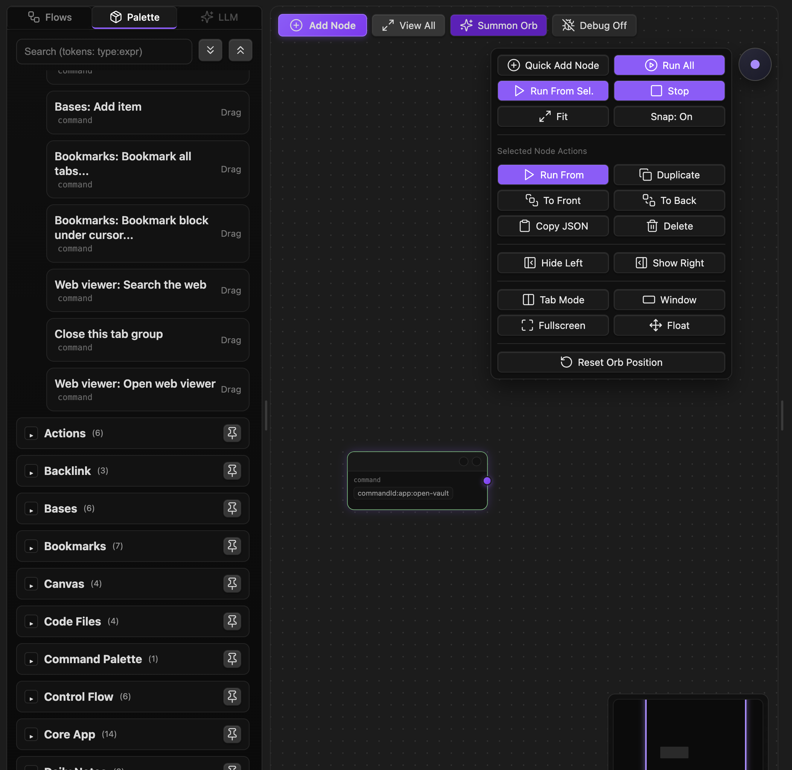
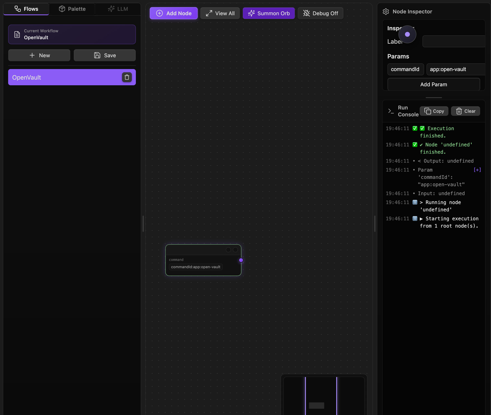

### Tab: Actions Manager 

- **Description**: A complete, node-based visual automation and workflow builder that functions as a low-code/no-code IDE directly within Obsidian. It provides an infinite canvas where users can create, connect, and configure a wide variety of nodes representing different actions. The component can execute these complex "flows" to perform tasks ranging from file manipulation and data processing to running Obsidian commands and making HTTP requests.
   
- **Does**:

    - **Visual Workflow & Infinite Canvas**:
        - Provides a limitless, pannable, and zoomable canvas for designing complex workflows.        
        - Users can create, connect, arrange, and multi-select nodes using intuitive mouse and keyboard controls (including marquee selection).
        - Renders bezier curves to clearly visualize the flow of data and execution between nodes.
    - **Powerful & Extensive Node Library**:
        - Features a comprehensive library of built-in action nodes, including:
            - **Input/Data**: Run Datacore queries, read files, or define manual JSON data.
            - **Data Processing**: Filter, sort, flatten, group, and transform arrays and objects using a powerful expression engine.
            - **Control Flow**: Includes If conditions, For Each and For loops, and Merge nodes to manage the execution path.
            - **Obsidian Actions**: Show notices, open files, run any command from the command palette, and prompt the user for input.
            - **File System**: Write new files or append content to existing ones.
    - **Full Workflow Execution Engine**:
        - Can execute the entire workflow, starting from "root" nodes that have no inputs.
        - Allows for running the flow from any selected node, or even executing a single node in isolation for debugging.
        - Provides a real-time, virtualized "Run Console" in the Inspector panel that logs the output and status of each node as it executes.
        - Supports stopping a long-running flow mid-execution.
    - **Complete State & Project Management**:
        - **Full Persistence**: Allows users to save entire workflows (nodes, connections, and canvas position) to JSON files within the vault. It includes a built-in browser to load, rename, and delete saved flows.
        - **Undo/Redo History**: Implements a complete undo/redo system, allowing users to step backward and forward through all changes made to the canvas.
        - **Clipboard Support**: Supports native copy (Ctrl+C) and paste (Ctrl+V) of nodes and their connections.
    - **Integrated Development Environment (IDE) Experience**:
        - Features a responsive, multi-pane layout with resizable side panels for the Node Palette (left) and the Inspector/Console (right).
        - The **Node Palette** is a searchable list of all available actions, allowing users to drag-and-drop new nodes onto the canvas.
        - The **Inspector Panel** provides a context-aware UI to edit the parameters of any selected node.
        - A **Floating Orb** provides quick, on-canvas access to common actions like running the flow, toggling panels, and managing the view.

- **Can’t**:
   
    - **Provide Live Step-Through Debugging**: The Run Console provides logs after a node has executed, but it does not include features like setting breakpoints or stepping through code line-by-line within a script node.    
    - **Be Triggered Externally**: Workflows can only be initiated manually from within the component's UI. They cannot be automatically triggered by Obsidian events like file changes or on a schedule.
    - **Guarantee Against Infinite Loops**: The While loop node is a powerful tool, but if configured incorrectly, it can lead to an infinite loop that may cause performance issues or hang the note.

- **Disclaimer**:

    - This component is a highly advanced and experimental proof-of-concept. Its primary purpose is to **showcase the absolute limits of Datacore's capabilities**, demonstrating a complete, stateful application with a complex UI, file system persistence, and a powerful execution engine. It is not intended to be a perfectly polished or bug-free application and serves as a powerful example of what is possible rather than a finished, stable tool.

----

### Components

###### [Actions Manager Viewer](D.q.actionsmanager.viewer.md)

###### [Actions Manager Components](D.q.actionsmanager.component.md)
