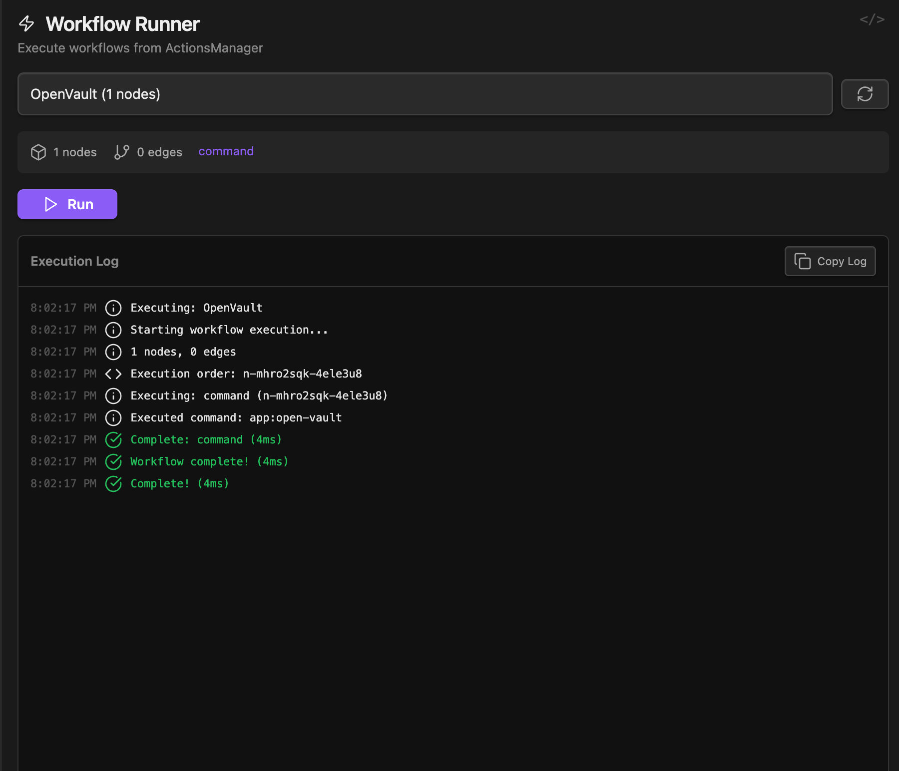

---
resources:
  - actionsflows.clip.webm
  - actions_flows.webp
author: beto.group
name.official: Actions Flow
price: "0"
version: 1.0.1
category:
  - automation
tags:
  - workflow
  - runtime
  - execution
  - console
  - logic
  - json
desc: A dedicated runtime engine for executing and monitoring complex automation workflows created in the Actions Manager.
status: experimental
complexity: intermediate
linked: Actions Manager
id: 51
longDesc: A dedicated execution engine for running complex, multi-step automations and workflows created in the "Actions Manager" component. It provides a simple, focused interface to select a pre-built workflow, execute it, and monitor its progress and output in a real-time log. It acts as the runtime environment for the visual programming language, turning graphical flows into executable tasks.
does: "[  {    \"title\": \"Workflow Discovery & Loading\",    \"children\": [      {        \"content\": \"Automatically discovers and lists all available workflow files (.json) from two locations: a central .datacore/flows/ directory and a local _resources/flows/ folder relative to the component's file.\"      },      {        \"content\": \"Allows the user to select any discovered workflow from a dropdown menu.\"      }    ]  },  {    \"title\": \"Robust Execution Engine\",    \"children\": [      {        \"title\": \"Topological Sort\",        \"content\": \"Before execution, it performs a topological sort on the workflow's nodes and edges. This analyzes the graph for circular dependencies and determines the correct, non-blocking order in which to run the nodes.\"      },      {        \"title\": \"Sequential & Parallel Execution\",        \"content\": \"It processes the nodes in the determined order, passing the output of one node as the input to the next. It correctly handles branching logic from If nodes and can process parallel execution paths.\"      }    ]  },  {    \"title\": \"Live Execution Monitoring\",    \"children\": [      {        \"title\": \"Real-Time Log\",        \"content\": \"Displays a detailed, live-updating log of the entire execution process. Each step, including node start, completion, errors, and duration, is printed with a timestamp.\"      },      {        \"title\": \"Color-Coded Feedback\",        \"content\": \"The log entries are color-coded by type (e.g., success, error, warning, info) for easy scanning and debugging.\"      },      {        \"title\": \"Copyable Log\",        \"content\": \"Includes a button to copy the entire execution log to the clipboard for analysis or sharing.\"      }    ]  },  {    \"title\": \"User Control\",    \"content\": \"Provides clear \\\"Run\\\" and \\\"Stop\\\" buttons, allowing the user to initiate the workflow and gracefully cancel a long-running process if needed.\"  },  {    \"title\": \"Immersive Full-Tab UI\",    \"content\": \"Designed to run in a full-pane mode that takes over the entire Obsidian view, creating a dedicated console-like environment for running and monitoring automations.\"  }]"
cant: '[  {    "title": "Create or Edit Workflows",    "content": "This component is strictly a runtime or execution engine. It cannot be used to create new nodes, connect them, or modify the logic of an existing workflow. All design and editing must be done in the \"Actions Manager\" component."  },  {    "title": "Be Triggered Automatically",    "content": "Workflows can only be initiated manually by clicking the \"Run\" button in the UI. It cannot be set up to run on a schedule, in response to a file change, or via a hotkey."  },  {    "title": "Provide Advanced Debugging",    "content": "The live log is the primary debugging tool. The component does not include features like setting breakpoints, stepping through node executions, or inspecting variables mid-flow."  }]'
disclaimer: '[  {    "content": "This component is a companion to the Actions Manager and is a proof-of-concept for executing complex, multi-step automations within Datacore. The success of a workflow is entirely dependent on the correctness of the flow designed in the Actions Manager. An improperly designed flow (e.g., with incorrect data types or faulty logic) will result in errors during execution."  }]'
version.obsidian: 1.4.11
---

### Tab: Actions Flow

- **Description**: A dedicated execution engine for running complex, multi-step automations and workflows created in the "Actions Manager" component. It provides a simple, focused interface to select a pre-built workflow, execute it, and monitor its progress and output in a real-time log. It acts as the runtime environment for the visual programming language, turning graphical flows into executable tasks.

- **Does**:
  
    - **Workflow Discovery & Loading**:    
        - Automatically discovers and lists all available workflow files (.json) from two locations: a central .datacore/flows/ directory and a local _resources/flows/ folder relative to the component's file.
        - Allows the user to select any discovered workflow from a dropdown menu.
    - **Robust Execution Engine**:
        - **Topological Sort**: Before execution, it performs a topological sort on the workflow's nodes and edges. This analyzes the graph for circular dependencies and determines the correct, non-blocking order in which to run the nodes.
        - **Sequential & Parallel Execution**: It processes the nodes in the determined order, passing the output of one node as the input to the next. It correctly handles branching logic from If nodes and can process parallel execution paths.
    - **Live Execution Monitoring**:
        - **Real-Time Log**: Displays a detailed, live-updating log of the entire execution process. Each step, including node start, completion, errors, and duration, is printed with a timestamp.
        - **Color-Coded Feedback**: The log entries are color-coded by type (e.g., success, error, warning, info) for easy scanning and debugging.
        - **Copyable Log**: Includes a button to copy the entire execution log to the clipboard for analysis or sharing.
    - **User Control**: Provides clear "Run" and "Stop" buttons, allowing the user to initiate the workflow and gracefully cancel a long-running process if needed.
    - **Immersive Full-Tab UI**: Designed to run in a full-pane mode that takes over the entire Obsidian view, creating a dedicated console-like environment for running and monitoring automations.

- **Can’t**:
   
    - **Create or Edit Workflows**: This component is strictly a **runtime or execution engine**. It cannot be used to create new nodes, connect them, or modify the logic of an existing workflow. All design and editing must be done in the "Actions Manager" component.    
    - **Be Triggered Automatically**: Workflows can only be initiated manually by clicking the "Run" button in the UI. It cannot be set up to run on a schedule, in response to a file change, or via a hotkey.
    - **Provide Advanced Debugging**: The live log is the primary debugging tool. The component does not include features like setting breakpoints, stepping through node executions, or inspecting variables mid-flow.

- **Disclaimer**:
   
    - This component is a companion to the Actions Manager and is a proof-of-concept for executing complex, multi-step automations within Datacore. The success of a workflow is entirely dependent on the correctness of the flow designed in the Actions Manager. An improperly designed flow (e.g., with incorrect data types or faulty logic) will result in errors during execution.

----

### Components

###### [Obsidian Actions Flow Viewer](D.q.actionsflows.viewer.md)

###### [Obsidian Actions Flow Components](D.q.actionsflows.component.md)
