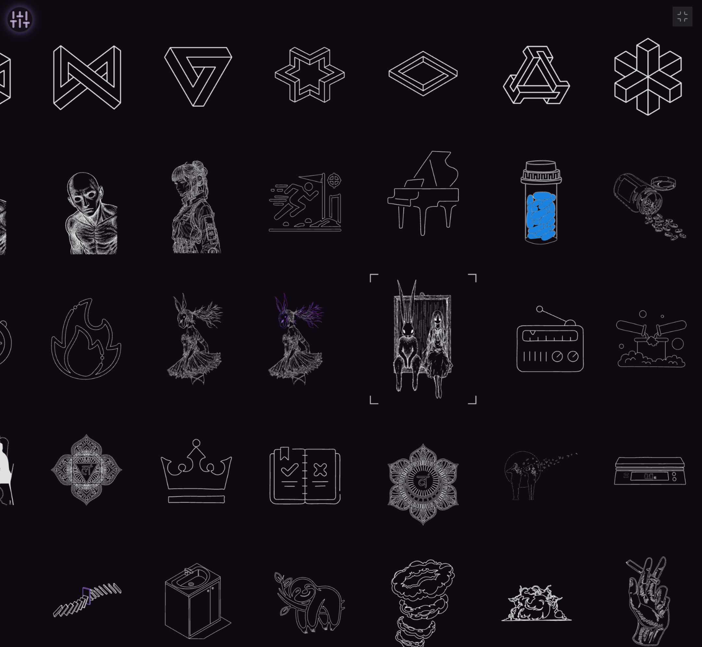
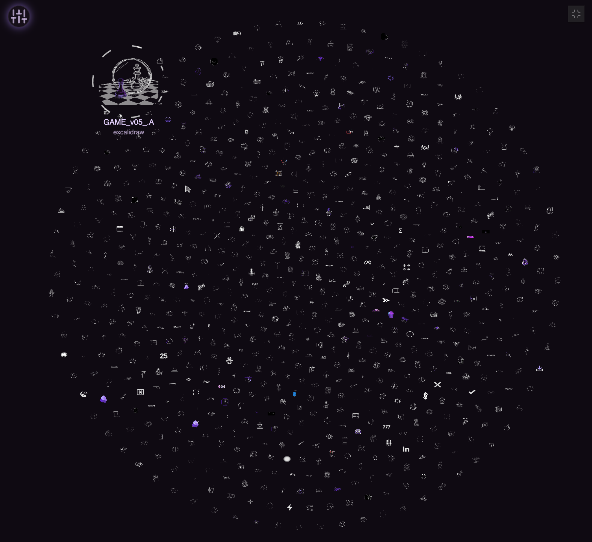
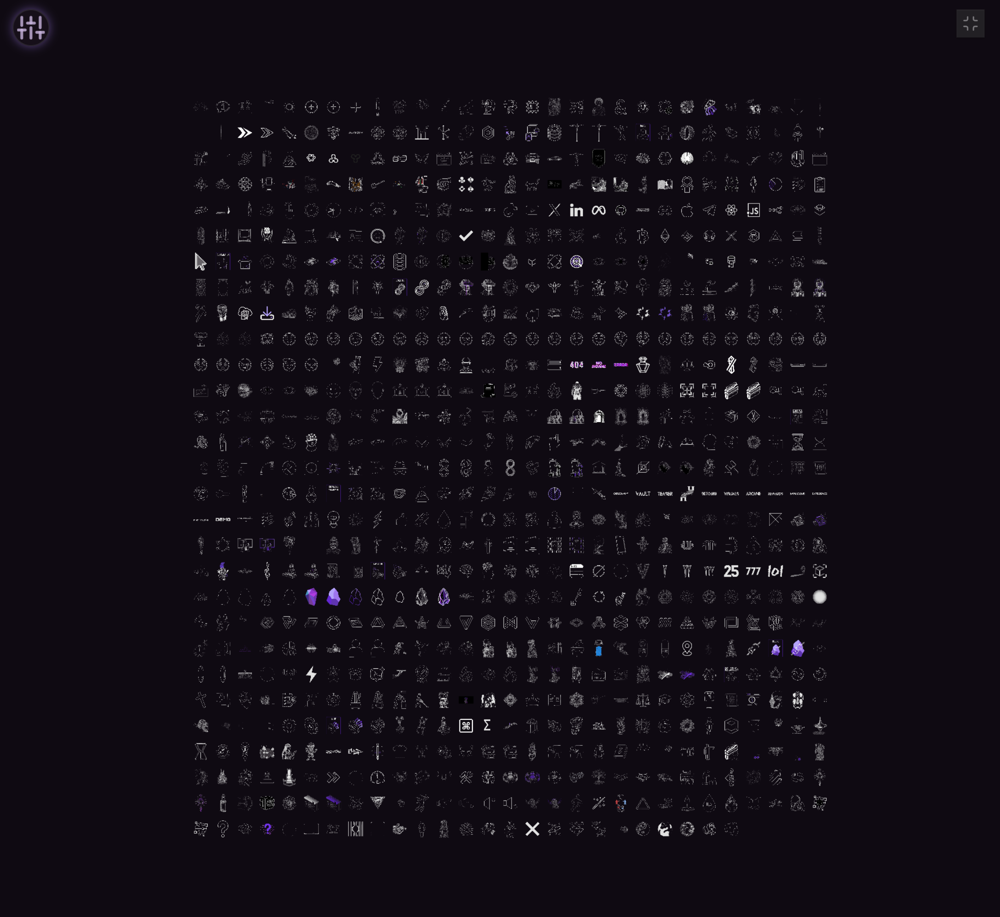

### Tab: Assets Library

- **Description**: A comprehensive, self-managing asset library that automatically synchronizes Excalidraw .md files from a remote GitHub repository, converts them into optimized .svg assets in the background, and displays them in a high-performance, interactive infinite canvas. It features multiple viewing modes, powerful search and filtering tools, and a robust, performance-first architecture designed to handle thousands of assets with a smooth user experience.

- **Does**:
   
    - **Automated GitHub Synchronization**:    
        - On first run, it requests user consent to download assets. Consent is saved locally to streamline future sessions.
        - **Smart Syncing**: Performs an initial sync and then intelligently re-syncs only on a weekly basis, unless the local asset folder is empty, in which case it syncs immediately. This balances freshness with performance.
    - **Background SVG Conversion Pipeline**:
        - Automatically detects .md files that are missing a corresponding .svg file or have been updated.
        - **Dependency-Aware**: Intelligently analyzes `[wikilink]` references between Excalidraw files and reorders the conversion queue to process dependent files last.
        - Generates optimized .svg files with embedded fonts for consistent rendering and saves them locally.
    - **High-Performance Rendering Engine**:
        - **Parallel & Progressive Loading**: Uses a multi-threaded approach where GitHub sync, SVG conversion, and canvas rendering all run in parallel. It progressively loads and displays assets that are currently in the viewport first.
        - **Web Worker Rasterization**: Offloads the intensive task of converting SVGs into bitmaps to a background web worker, preventing UI freezes and ensuring a smooth experience.
        - **Advanced Caching**: Caches rasterized images in memory and cleans up high-resolution versions when they are off-screen to conserve memory.
        - **Optimized Animations**: Uses staggered spawn delays and batching limits to create a silky-smooth cascade effect when loading assets, preventing frame rate drops.
    - **Dual Interactive Views**:
        - **Grid View**: An infinite canvas displaying assets in a clean, organized grid with smooth panning and zooming.
        - **Graph View**: A physics-based, force-directed graph where assets are represented as nodes that repel each other. Users can click and drag nodes to interact with the simulation.
    - **Rich UI & Asset Management Tools**:
        - **Floating Control Panel**: A draggable UI panel with tools for searching, sorting, switching views, and managing selections.
        - **Search & Filtering**: Allows users to filter assets by filename or by tags extracted from the frontmatter of the source .md files.
        - **Selection & Mass Editing**: A "Selection Mode" allows for selecting multiple assets. A "Mass Edit Panel" then appears, enabling users to apply or update frontmatter properties (like tags) to all selected assets at once.
        - **Detailed Asset View**: Clicking an asset opens a modal with a zoomable, high-resolution view and provides quick actions like copying the markdown link, copying the raw SVG content, or temporarily hiding the asset.

- **Can’t**:
   
    - **Edit Excalidraw Files**: It is a viewer and asset manager, not an editor. It cannot be used to create or modify the content of the Excalidraw drawings.    
    - **Handle Other Asset Types**: The entire pipeline is purpose-built for processing .md files containing Excalidraw data and generating .svg files from them. It cannot manage or display other image types like PNGs or JPEGs.
    - **Function Without Initial Consent**: The component is gated by a consent screen. It will not perform any file operations (downloading, creating, or writing files) until the user explicitly agrees.
    - **Function Offline on First Run**: It requires an internet connection for its initial run to download dependencies (like the Excalidraw library) and to perform the first asset sync from GitHub.
    - **Customize the GitHub Source**: The component is hard-coded to sync from a specific GitHub repository (beto-group/beto.assets).

- **Disclaimer**:
   
    - This component is a highly experimental and advanced proof-of-concept. Its primary purpose is to **showcase the absolute limits of Datacore's capabilities**, demonstrating background processing, web workers, file system I/O, and complex, performance-oriented UI rendering. It is not intended to be a perfectly polished or bug-free application. Given that it performs a large number of background file operations, users may encounter unexpected behavior. It serves as a powerful demonstration of what is possible rather than a finished, stable tool.

-----

### COMPONENTS
###### [Assets Library Viewer](D.q.assetslibrary.viewer.md)

###### [Assets Library Components](D.q.assetslibrary.component.md)
