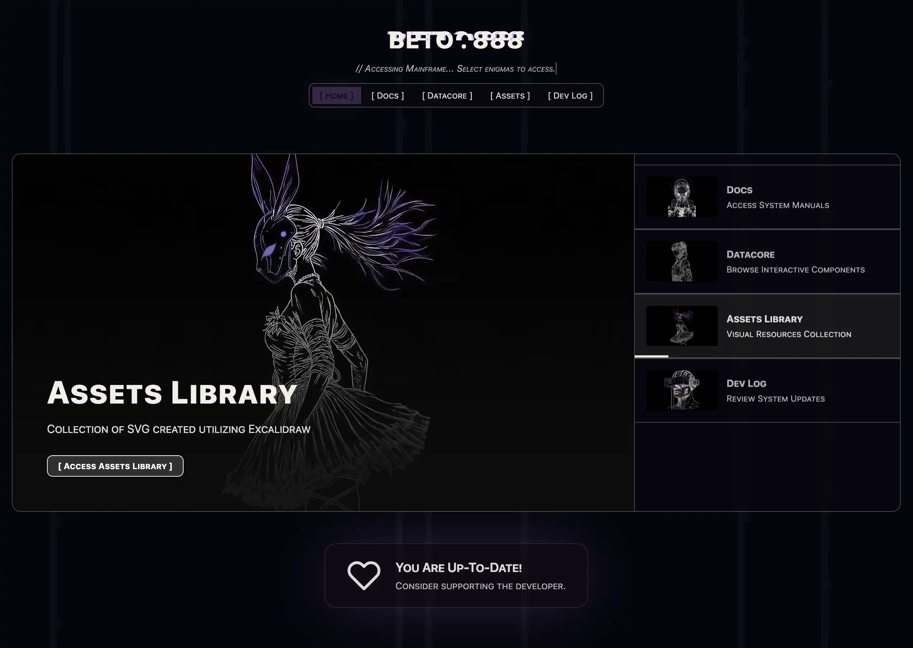
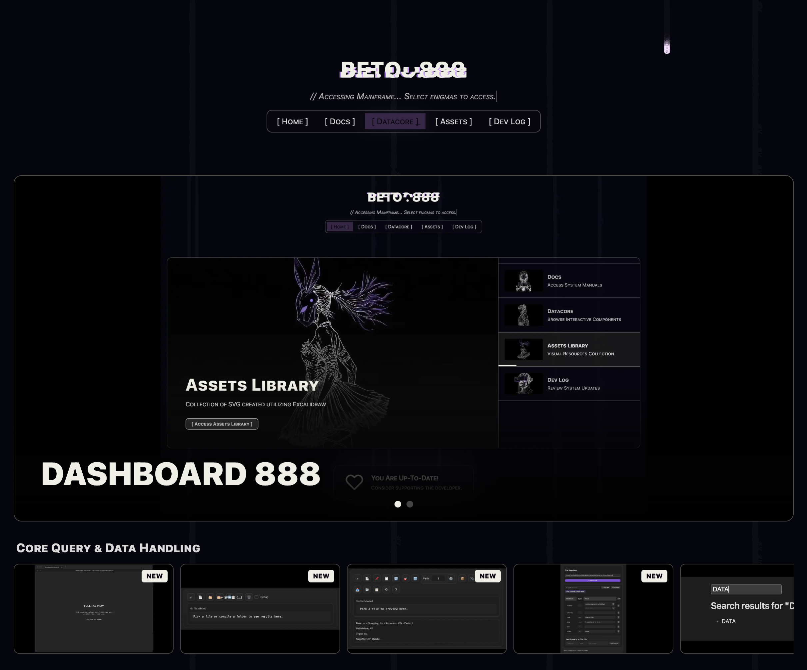
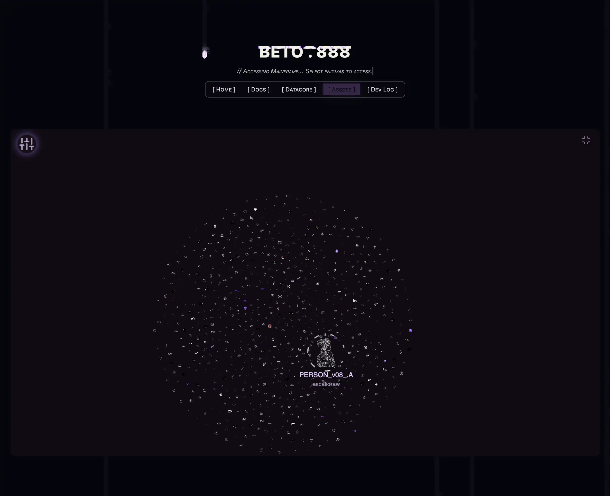
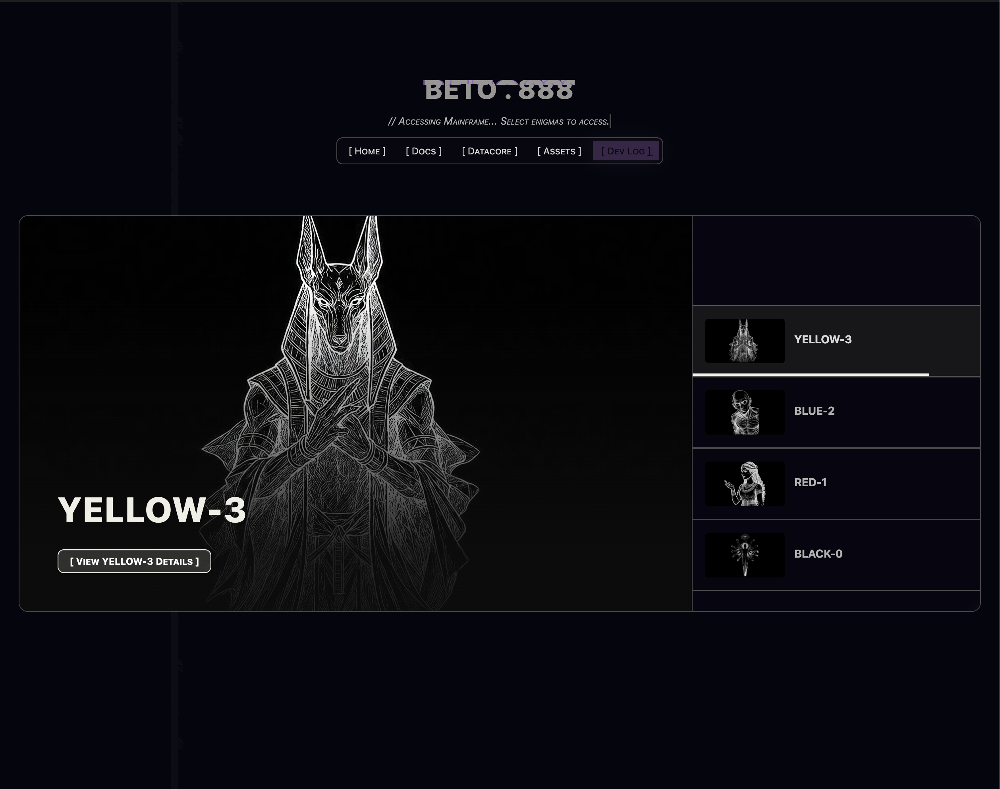

### Tab: Dashboard 888

- **Description**: A rich, interactive documentation browser designed for exploring a structured knowledge base of components and concepts. It dynamically scans and parses a master SKILLS.bet8.md file to build a multi-category, multi-module interface. Users can browse components in a visually engaging grid, then dive into a detailed view with a sticky navigation header, animated icons, collapsible sections, and a floating "on this page" outline that tracks scroll position. It also includes a live renderer for datacorejsx code blocks, allowing for interactive examples directly within the documentation.
   
- **Does**:

    - **Dynamic Content Aggregation**:
        - Scans a central SKILLS.bet8.md file to automatically build its category and module structure, making the documentation easy to update and maintain.
        - Parses structured markdown files for each module, intelligently extracting the title, description, and detailed sections like "Use When," "Info," and code examples into collapsible UI components.
    - **Rich, Interactive Browsing**:        
        - **Grid View**: Displays modules for a selected category in a grid of tiles, each featuring a dynamically animated SVG icon that "draws" itself into view.
        - **Detail View**: Provides an in-depth look at a selected module, with a clean, modern layout, a sticky navigation header, and a floating "On This Page" outline that highlights the current section as you scroll.
        - **Icon Navigation**: Includes a horizontal scroller of animated icons in the detail view, allowing users to quickly jump between related modules in the same category.
    - **Live Code Execution**:        
        - Features a datacorejsx renderer that uses Babel (loaded from the vault) to transpile and execute live React/JSX code blocks directly within the documentation, enabling interactive demos and examples.
    - **Advanced Markdown Rendering**:        
        - Supports extended markdown features like callouts (e.g., >`[!note]`), tables, and nested lists.
        - Automatically finds and renders embedded media (images and videos) using Obsidian's  syntax.
        - Includes a sophisticated code block component with syntax highlighting (via Shiki), a language label, and a one-click "copy code" button.

- **Can’t**:    

    - Edit the documentation content directly; it is a read-only interface.
    - Function if the master documentation file (_RESOURCES/DATACORE/53.1 Dashboard888/_resources/content/SKILLS.bet8.md) is missing or improperly formatted.
    - Render datacorejsx code blocks if the required Babel script is not present in the vault.
    - Display icons for modules that are not correctly named or aliased in the component's configuration.

-----

### COMPONENTS

###### [Dashboard 888 Viewer](D.q.dashboard888.viewer.md)

###### [Dashboard 888 Entry Point](src/ViewComponent.md#ViewComponent_v2)

