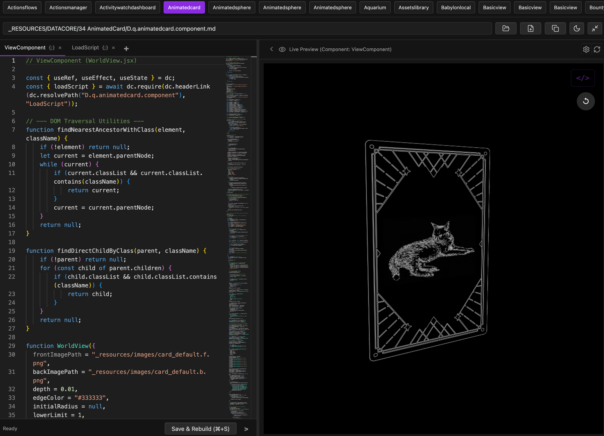

### Tab: Datacore Playground

- **Description**: A full-featured, multi-pane Live Development Environment (IDE) that provides a complete workflow for creating, editing, and live-testing Datacore components, all from within a single, powerful interface. It combines a multi-tab Monaco editor, a sandboxed live preview, and a full-featured props editor, enabling a seamless and rapid "hot-reloading" development cycle without leaving Obsidian.
   
- **Does**:

    - **Advanced Code Editing with Monaco**:    
        - **Professional Editor**: Integrates the **Monaco Editor** (the same editor that powers VS Code) for a first-class coding experience, including syntax highlighting, autocompletion, and multi-cursor support.
        - **Multi-Component Editing**: Allows a single component file with multiple headers (e.g., # ViewComponent, # HelperFunctions) to be edited as separate tabs within the same editor instance.
        - **Tab Management**: Users can create new component tabs, rename them (which also refactors the code), and delete them, with all changes saved back to the source .md file.
    - **Sandboxed Live Preview & Hot-Reloading**:
        - **Live Preview**: Features a dedicated preview pane that dynamically loads and renders the selected component.
        - **Crash Protection**: The preview is wrapped in an ErrorBoundary, so if the component's code has a rendering error, it will display a detailed error message instead of crashing the entire IDE.
        - **Hot-Reload on Save**: When the user saves their code (Ctrl/Cmd + S), the component automatically creates a temporary, cache-busted copy of the file and instantly re-renders the preview with the latest changes, enabling a true hot-reload workflow.
        - **Context Hijacking**: Intelligently hijacks the dc.useCurrentPath() hook for the previewed component, making it believe it's running from its original file path. This ensures that components with relative asset paths work correctly within the playground.
    - **Interactive Prototyping with Props Editor**:
        - Includes a "Component Props" panel that allows developers to dynamically add, edit, and remove properties passed to the component being previewed.
        - It intelligently parses prop values, supporting strings, numbers, booleans, and even complex JavaScript objects and arrays (e.g., title="Hello", count={42}, data=`{[{id:1}]})`.
        - **Instantly re-renders** the preview component with the new props, allowing for rapid testing of different states and configurations.
    - **Full-Featured IDE Interface**:
        - **File Loading**: Includes a file loader with a "Bookmark Bar" that automatically discovers and lists all available .component.md files in the vault for quick access.
        - **Customizable Multi-Pane Layout**: The IDE features a responsive, multi-pane layout with a resizable divider between the editor and preview panes. The user can also toggle panes to focus on just the code or the preview.
        - **Immersive Full-Tab Mode**: Designed to run in an immersive, full-pane "Full Tab" mode for a complete, distraction-free development experience.
    - **Self-Contained & System-Aware**:
        - Automatically checks for and caches its dependencies (Monaco Editor) for faster subsequent loads.
        - Automatically syncs its theme (light/dark) with Obsidian's theme, but also includes a manual override.

- **Can’t**:
   
    - **Provide a Full File Explorer**: While it has a bookmark bar for component files, it does not include a traditional file tree for navigating the entire vault.    
    - **Debug Code with Breakpoints**: It provides excellent error catching and a linter, but it is not a full-fledged debugger. It does not support setting breakpoints or stepping through code execution.
    - **Manage Git Repositories**: This is a code editor and playground, not a version control client.

- **Disclaimer**:
  
    - This is a highly advanced developer tool. Its primary purpose is to showcase the absolute limits of Datacore's capabilities, including live hot-reloading, component sandboxing, and building complex, IDE-like applications. It directly modifies your files and maintains its own temporary files for previews. While powerful, it should be used with care. It serves as a powerful example of what is possible rather than a finished, production-ready tool.

-----

### Components

###### [Datacore Playground Viewer ](D.q.datacoreplayground.viewer.md)

###### [Datacore Playground Component](D.q.datacoreplayground.component.md)

