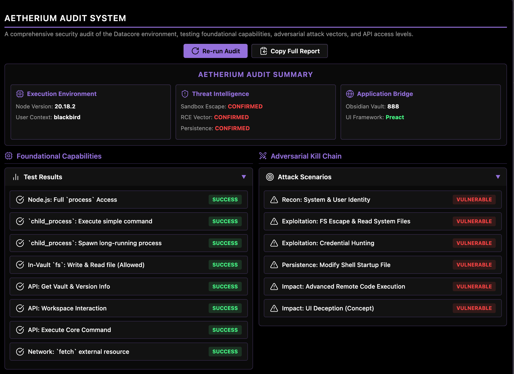
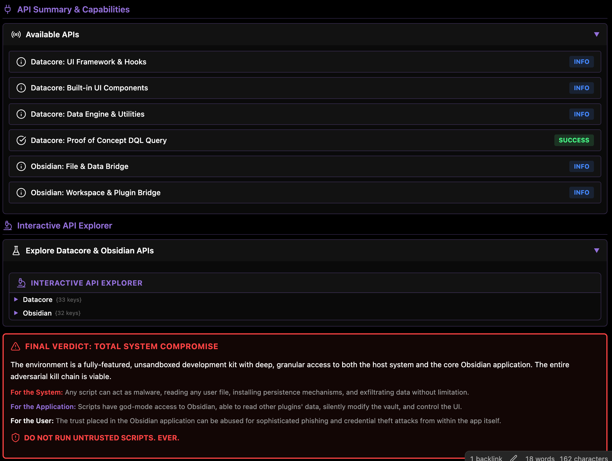

### Tab: Datacore Limitations

- **Description**: An advanced, self-contained security auditing tool designed to run a comprehensive suite of tests against the live Datacore and Obsidian environment. It probes for vulnerabilities and access levels across the file system, core application APIs, and Node.js process execution. The component presents its findings in a detailed, interactive "Threat Matrix" dashboard, providing a clear and stark analysis of the security posture.

- **Does**:
   
    - **Runs a Multi-Vector Audit**: When initiated, it executes a series of automated tests grouped into three categories:    
        - **Foundational Capabilities**: Verifies access to core system functionalities like Node.js process information, child_process for running shell commands, fs for file system access, and network requests via fetch.
        - **Adversarial Kill Chain**: Actively simulates a malicious attack by attempting to perform reconnaissance (gathering user and system info), exploit vulnerabilities (like file system sandbox escapes), establish persistence (by attempting to modify shell startup files), and achieve impact (via remote code execution).
        - **API Access Summary**: Probes the scope of the Datacore and Obsidian APIs, confirming access to the vault, workspace, command execution, and Datacore's query engine.
    - **Presents an Interactive Threat Dashboard**:
        - **Threat Matrix Summary**: After the audit, it displays a high-level summary dashboard visualizing the most critical findings, such as whether a sandbox escape or remote code execution vector was confirmed.
        - **Detailed Test Results**: All test results are presented in expandable sections. Each test shows its name, a clear status (e.g., SUCCESS, VULNERABLE, SECURE), and detailed technical information about the test's outcome.
    - **Live API Explorer**: Includes a built-in, interactive object explorer that allows the user to drill down into the live dc (Datacore) and app (Obsidian) global objects. This provides a powerful, real-time tool for developers and security researchers to inspect the full scope of available APIs.
    - **Clear & Actionable Verdict**: Concludes with a stark, unambiguous "Final Verdict" that summarizes the security implications of the test results in plain language, explaining the risks to the system, the application, and the user.
    - **Immersive Full-Tab UI**: Designed to run in a full-pane mode that takes over the entire Obsidian view, creating a dedicated, terminal-like environment for conducting and reviewing the security audit.

- **Can’t**:
   
    - **Fix or Mitigate Vulnerabilities**: This is purely an auditing and reporting tool. It identifies and demonstrates potential security risks but does not provide any mechanisms to patch or fix them.    
    - **Run External Security Scanners**: All tests are self-contained and executed from within the component's own code. It does not integrate with external security tools like vulnerability scanners or antivirus software.
    - **Persist Audit Results**: The results of the audit are for the current session only. They are not saved to a file and will be cleared when the component is reloaded. (Though a "Copy Full Report" button is provided).

- **Disclaimer**:
   
    - This component is a powerful and potentially dangerous security research tool. It is designed to **actively attempt to exploit the unsandboxed nature of the environment**. It will try to read system files, execute shell commands, and modify user configuration files as part of its audit. It should be used with extreme caution and only for educational or security research purposes. It serves as a critical demonstration of the security model (or lack thereof) rather than a standard productivity tool.

----

### COMPONENTS

###### [Datacore Limitations Viewer](D.q.datacorelimitations.viewer.md)

###### [Datacore Limitations Components](D.q.datacorelimitations.component.md)
