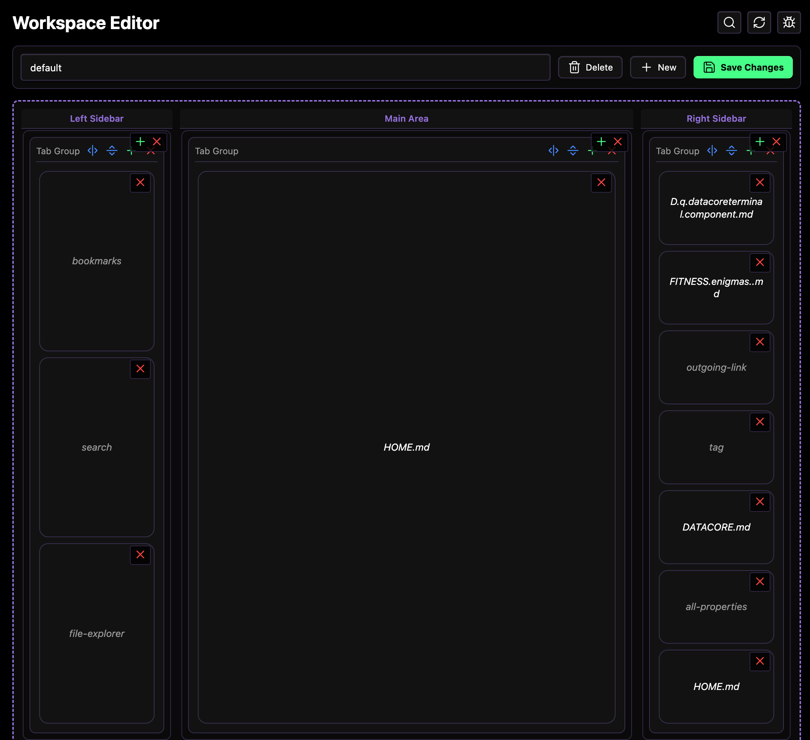

### Tab: Workspace Manager

- **Description**: An advanced, visual editor that provides direct, real-time manipulation of Obsidian's core workspace layouts. It fetches the raw JSON configuration for any saved "Workspace" and renders it as an interactive block diagram. Users can then structurally modify this layout—by adding, deleting, splitting, and rearranging panes—and save the changes directly back to the workspace configuration file.

- **Does**:
   
    - **Live Workspace Loading**:    
        - Automatically detects and lists all saved workspaces from the "Workspaces" core plugin.
        - Loads the selected workspace's JSON data and renders a live, interactive representation of its structure (main area, left sidebar, right sidebar).
    - **Visual Layout Manipulation**:
        - **Drag-and-Drop Panes**: All panes, tabs, and split containers can be moved and re-nested by dragging and dropping them into other containers.
        - **Pane Splitting**: Any tab group can be split vertically or horizontally, creating a new split container with an empty pane, just like in Obsidian.
        - **Add/Delete Panes**: Users can add new empty panes to any tab group or delete existing panes and splits. Deleting a split with only two children will intelligently collapse the container and promote the remaining child.
    - **File Integration**:
        - Includes a built-in, searchable file panel that lists all markdown files in the vault.
        - Users can drag files from this panel and drop them onto any empty pane in the layout to assign that file to the pane.
    - **Direct Configuration Saving**:
        - Features a "Save Changes" button that takes the modified visual layout, converts it back into the clean JSON format that Obsidian expects, and **overwrites the original workspace file**.
        - Allows for creating new, empty workspaces and deleting existing ones directly from the UI.
    - **Immersive Full-Tab UI**: Designed to run in a full-pane mode that takes over the entire Obsidian view, providing a dedicated, app-like environment for workspace editing.

- **Can’t**:
   
    - **Render Live Previews of Panes**: The editor displays a structural representation of the workspace. Leaf panes are shown as simple blocks with the name of the file they contain. It **does not** render a live, interactive preview of the actual notes or components within those panes.    
    - **Edit Pane-Specific State**: It can assign a file to a pane but cannot modify the internal state of that pane (e.g., a note's scroll position, a Kanban board's card positions).
    - **Automatically Sync with Live Workspace**: All edits are made to the saved workspace configuration. The changes are **not reflected in the live Obsidian UI until the user manually loads the saved workspace** through the command palette or status bar.

- **Disclaimer**:
   
    - This is a highly advanced "meta" tool that directly modifies core Obsidian configuration files. While powerful, it operates on the raw JSON data of your workspaces. Incorrectly saving a modified layout could potentially corrupt a workspace file. **It is strongly recommended to back up your .obsidian/workspaces.json file before making significant changes.** This component is a proof-of-concept for deep application-level integration and should be used with caution.

----

### COMPONENTS

###### [Workspace Manager Viewer](D.q.workspacemanager.viewer.md)

###### [Workspace Manager Component](D.q.workspacemanager.component.md)

