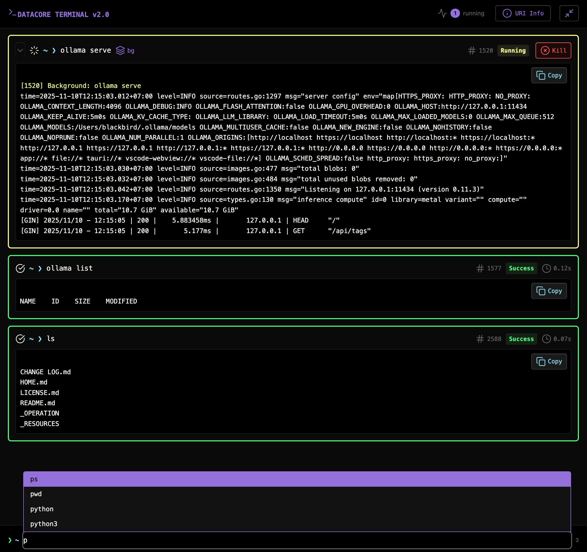

### Tab : Datacore Terminal

- **Description**: A full-featured, standalone terminal emulator that runs directly within Obsidian, providing native shell access to your file system. It leverages Node.js's child_process module to spawn a real shell (zsh, bash, powershell, etc.), allowing users to run almost any command-line tool, manage background processes, and interact with their system without ever leaving Obsidian.

- **Does**:
   
    - **Native Shell Integration**: Spawns a real user shell process, inheriting the system's PATH and environment. This allows it to run standard commands like ls, git, npm, python, and more.    
    - **Full Command-Line Interface**:
        - Provides a familiar terminal interface with a command prompt, input history (navigable with arrow keys), and tab-based autocompletion for common commands.
        - Supports essential keyboard shortcuts like Ctrl+C to interrupt a running process and Ctrl+L to clear the screen.
    - **Advanced Process Management**:
        - **Background Processes**: Automatically detects long-running commands (like npm run dev or a local server) and runs them as background processes, allowing the user to continue using the terminal.
        - **Process Panel**: Features a dedicated panel to view all currently running background processes, showing their Process ID (PID), command, and runtime. Users can terminate any process directly from this UI.
    - **Customizable Environment**:
        - **Aliases**: Supports creating and using command aliases (e.g., alias gs='git status') for faster workflow.
        - **Environment Variables**: Allows users to set session-specific environment variables using the export command.
    - **Remote Execution via URI**:
        - Exposes a global window.startSystemProcess() function, which can be called via the Obsidian Advanced URI plugin. This allows other notes, plugins, or external tools to remotely execute shell commands in the terminal.
    - **Self-Contained & Dependency-Free**: Uniquely, this component has **no external web dependencies**. It uses only the APIs provided by Node.js and Preact (via Datacore), making it fast, reliable, and fully offline-capable from the first run.
    - **Immersive Full-Tab UI**: Designed to run in a full-pane mode that takes over the entire Obsidian view, creating a dedicated, IDE-like terminal experience.

- **Can’t**:

    - **Run Interactive REPLs**: It is designed for executing commands and viewing their output. It does not support interactive Read-Eval-Print Loops (REPLs) like a standalone python or node shell.        
    - **Provide a True TTY Experience**: It is a powerful command runner but not a full terminal emulator. It does not support advanced TTY features like cursor positioning, which are required for complex terminal applications like vim or htop.
    - **Persist State Across Sessions**: All command history, aliases, and environment variables are for the current session only and will be lost when the component is reloaded.
    - **Elevate Privileges**: All commands are run with the same permissions as the Obsidian application itself. It cannot be used to run commands that require administrator or sudo privileges.

- **Disclaimer**:

    - This is a highly advanced developer tool that provides **direct, unsandboxed access to your computer's shell**. It can execute any command that your user account has permission to run, including file modifications and deletions. **Use this component with extreme caution.** It is a powerful proof-of-concept for deep system integration and should only be used if you fully understand the commands you are running.

----

### COMPONENTS

###### [Datacore Terminal Viewer](D.q.datacoreterminal.viewer.md)

###### [Datacore Terminal Component](D.q.datacoreterminal.component.md)

