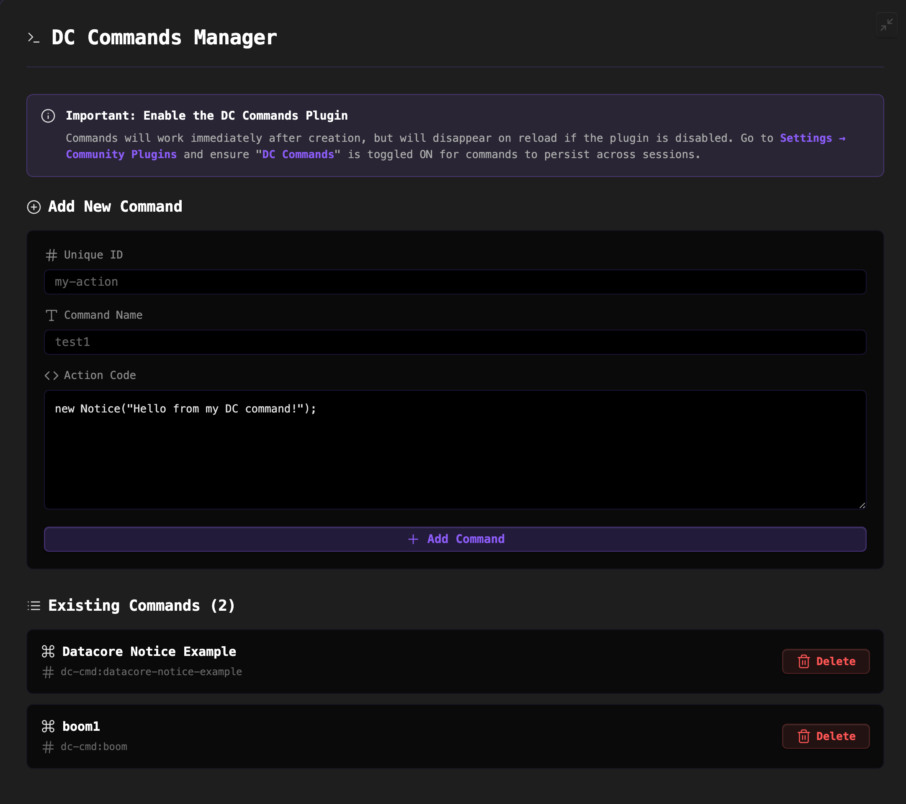

### Tab : Datacore Command Manager

- **Description**: A powerful "meta" component that acts as a management system for creating custom Obsidian commands. It provides a UI to define new commands and then programmatically generates and manages a lightweight, dedicated Obsidian plugin (DC Commands) to register these commands with the application. This allows users to create persistent, globally accessible commands directly from a Datacore component.

- **Does**:
   
    - **Automated Plugin Management**:    
        - **One-Click Installation**: On its first run, it presents a setup screen that, with a single click, creates a complete, functional Obsidian plugin (dc-cmd) in the user's vault, including the necessary main.js and manifest.json files.
        - **Automatic Enabling**: After creating the plugin files, it programmatically enables the plugin, making it immediately active.
    - **Custom Command Creation**:
        - Provides a clean user interface to define new commands by specifying three key properties:
            1. **Unique ID**: A short, unique identifier for the command (e.g., my-action).
            2. **Command Name**: The user-friendly name that will appear in Obsidian's command palette (e.g., My Custom Action).
            3. **Action Code**: The JavaScript code that will be executed when the command is run. This code has access to both the global Notice class for displaying messages and the dc (Datacore) object for more advanced interactions.
    - **Live & Persistent Command Registration**:
        - **Live Registration**: When a new command is created, it is **instantly** registered with Obsidian's command manager and becomes available in the command palette without requiring an application reload.
        - **Persistent Storage**: All created commands are saved to a data.json file inside the generated plugin's directory. On startup, the plugin reads this file and re-registers all the user's custom commands, ensuring they persist across Obsidian sessions.
    - **Full Command Lifecycle Management**: Allows users to view a list of all their created commands and delete any command, which both removes it from the live command palette and deletes it from the persistent data.json file.
    - **Immersive Full-Tab UI**: Designed to run in a full-pane mode that takes over the entire Obsidian view, providing a dedicated, IDE-like environment for command management.

- **Can’t**:
   
    - **Function Without the Core Plugin**: The component is a **manager** for the DC Commands plugin. If this plugin is not installed and enabled, the commands will not be loaded or persisted when Obsidian restarts.    
    - **Create Commands with Hotkeys**: The UI allows for the creation of the command itself, but it does not provide an interface to assign a keyboard shortcut (hotkey) to it. This must be done through Obsidian's native "Settings → Hotkeys" menu.
    - **Provide an Advanced Code Editor**: The "Action Code" is entered into a standard `<textarea>`. It does not include a full-featured code editor like Monaco or Ace with syntax highlighting or autocompletion.
    - **Edit Existing Commands**: The current UI supports creating and deleting commands but does not provide a way to edit the code of an existing command. To change a command, the user must delete it and recreate it.

- **Disclaimer**:
   
    - This component is a highly advanced "meta" tool that directly creates and modifies files within your .obsidian/plugins directory. It uses Node.js's fs module to write a new plugin to your vault. While this is a powerful demonstration of Datacore's capabilities, it should be used with a clear understanding of its function. It is a proof-of-concept for deep application-level integration and not a polished, production-ready tool.

----

### COMPONENTS

###### [Datacore Command Manager Viewer](D.q.datacorecommandmanager.viewer.md)

###### [Datacore Command Manager Component](D.q.datacorecommandmanager.component.md)

