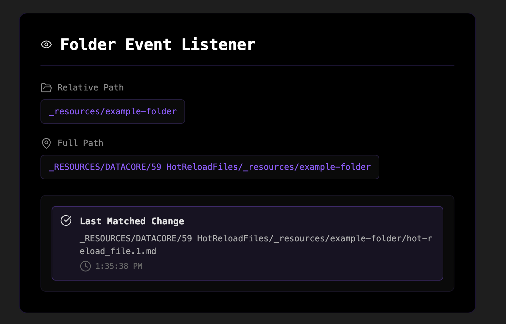

### Tab: Hot Reload Files

- **Description**: A developer-focused utility component designed to monitor a specific folder within the vault for any file changes. It listens to Obsidian's raw file system events and provides a real-time UI that displays the details of the last detected change within the target directory.

- **Does**:
   
    - **Relative Path Monitoring**: Watches a folder path (_resources/example-folder) that is **relative to the location of the component file itself**. This makes the component portable, as it will always monitor the correct subfolder no matter where the parent component note is moved.
    - **Live Event Listening**: Hooks directly into Obsidian's vault.on('raw', ...) event stream. This allows it to listen for all file system events, including creations, modifications, and deletions, as they happen.
    - **Intelligent Filtering**: Filters the global event stream to only react to changes occurring within its designated watchFolder. All other file changes in the vault are ignored.
    - **Real-Time UI Feedback**:
        - Displays the fully resolved, absolute path of the folder it is currently monitoring.
        - When a change is detected, the UI instantly updates to show the full path of the modified file and the exact time the event occurred.
    - **Debounced Notifications**: To prevent a storm of notifications when a file is saved multiple times in quick succession (e.g., by an auto-saving application), it uses a debouncing mechanism. It waits for one second of inactivity before showing an Obsidian Notice about the file change, ensuring only one notification is shown per burst of saves.

- **Can’t**:

    - **Watch Multiple Folders**: The component is hardcoded to watch a single, specific relative folder and cannot be configured to monitor multiple directories at once.
    - **Be Configured via Props**: The folder path to watch (_resources/example-folder) is hardcoded in the component's source. It cannot be changed via component properties.
    - **Show a History of Changes**: The UI only displays the **last detected change**. It does not maintain or show a log of all previous file system events.
    - **Distinguish Between Event Types**: It listens to the generic 'raw' event, which fires for any change. The UI does not differentiate between whether a file was created, modified, or deleted.

- **Disclaimer**:
   
    - This is a developer utility designed to demonstrate and test file system event handling within Datacore. Its primary purpose is for debugging and monitoring, not for end-user content display. The console will log all file events, including those that are filtered out by the component.

----

### COMPONENTS

###### [Hot Reload Files Viewer](D.q.hotreloadfiles.viewer.md)

###### [Hot Reload Files Component](D.q.hotreloadfiles.component.md)

