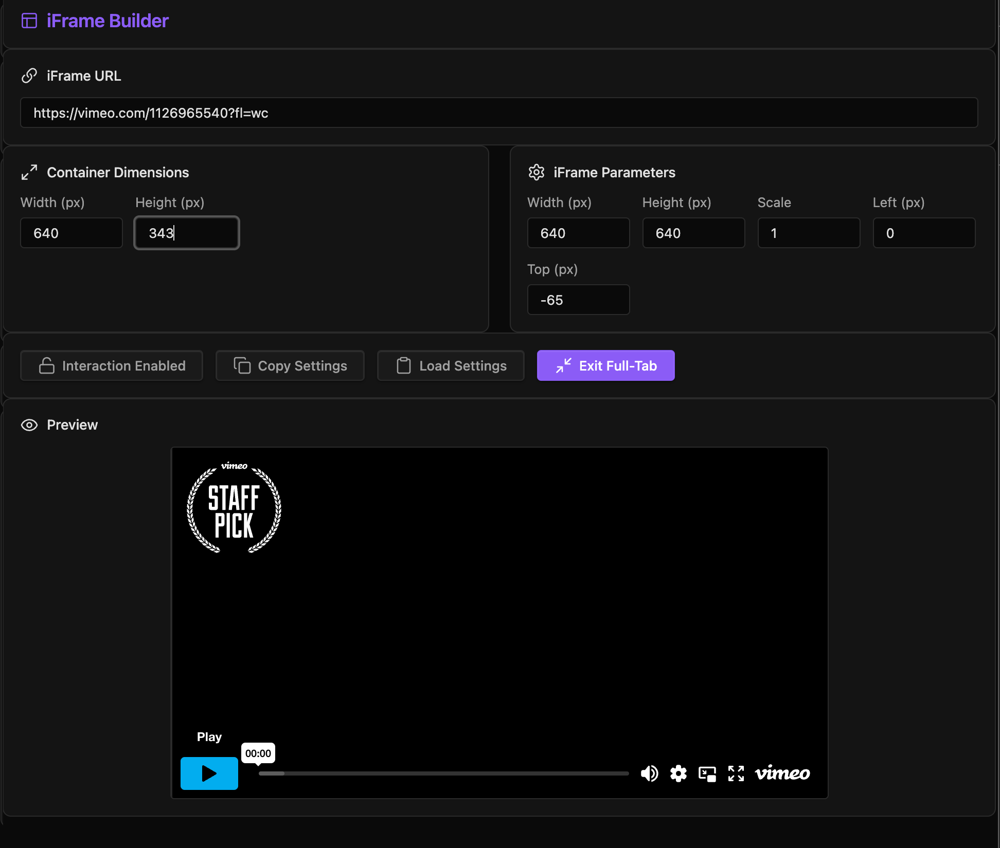

### Tab: Custom Iframe Builder

- **Description**: A specialized developer tool designed to solve the common problem of "awkwardly sized embeds." It allows users to input a URL (e.g., YouTube Short, TikTok, Instagram Reel) and automatically generates the optimal container dimensions, scale factor, and positioning to make the iframe look like a native app view. It features a visual preview, real-time adjustment controls, and the ability to export these settings as JSON.

- **Does**:
   
    - **Smart Platform Detection**:        
        - Automatically detects URLs from major platforms (YouTube, Shorts, TikTok, Instagram, Facebook, Snapchat, etc.).
        - Applies pre-defined "Guidelines" (presets) to instantly configure the iframe's width, height, scale, and crop offsets for a perfect mobile-like presentation.
    - **Visual Builder Interface**:
        - **Live Preview**: Renders the iframe in a resizable container, showing exactly how the final embed will look.
        - **Fine-Tuning**: Provides manual input fields to adjust every parameter (Container Size, Iframe Size, Scale, Top/Left Offset) in real-time.
    - **Interaction Control**:
        - Features a "Lock/Unlock Interaction" toggle. When locked, clicks pass through the iframe to allow dragging/sizing without pausing the video. When unlocked, the user can interact with the embedded content normally.
    - **Export & Import**:
        - **Copy Settings**: Exports the current configuration to the clipboard as a JSON object, ready to be pasted into other components (like the Custom Feed or Animated Card).
        - **Load Settings**: Can read a configuration JSON from the clipboard and apply it to the builder.
    - **Responsive & Full-Tab**:
        - Automatically monitors the container size.
        - Can expand to **Full-Tab Mode** for a distraction-free workspace, or function as a compact inline tool.

- **Can’t**:
   
    - **Embed All Sites**: While it works with most URLs, some websites (like standard Google search or banking sites) send X-Frame-Options: DENY headers that strictly block them from being embedded in an iframe.        
    - **Remove Ads/Overlays**: It adjusts the view of the content (zooming, cropping) but cannot inject code into the iframe to remove ads or modify the external website's DOM due to browser security (CORS/Same-Origin Policy).
    - **Auto-Save**: Configurations are session-based. You must "Copy Settings" to save your work externally; it does not save a list of created iframes in the vault.

---

### Components

###### [Custom Iframe Builder Viewer](D.q.customiframebuilder.viewer.md)

###### [Custom Iframe Builder Component](D.q.customiframebuilder.component.md)