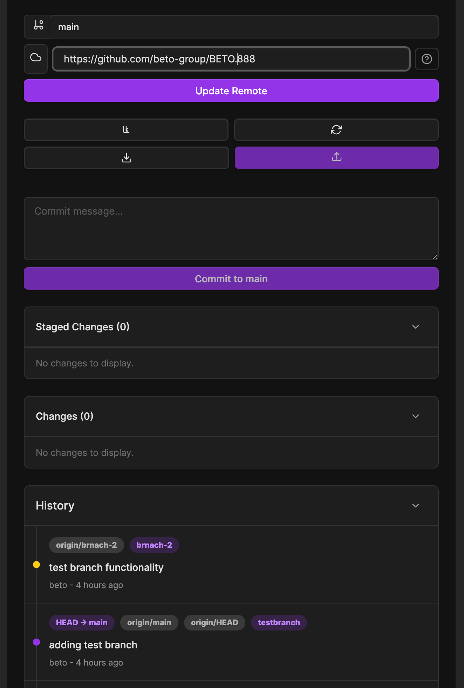

### Tab : Git Suite Manager

- **Description**: A complete, self-contained Git source control panel designed to run directly within a Datacore view. It provides a comprehensive graphical user interface for managing a Git repository inside your vault by leveraging your system's own Git installation. It guides users through the entire setup process, from checking for a valid Git installation to configuring user identity, and offers a full suite of tools for common workflows like committing, pushing, pulling, and branch management—all without needing an external Git plugin.

- **Does**:

    - **Guided Setup & Validation**:
        - Automatically detects if Git is installed on your system and provides platform-specific installation instructions if it's missing.    
        - Checks for global user.name and user.email configurations and provides a simple form to set them if they are not found.
    - **Full-Featured Git UI**:        
        - Provides a visual interface to stage individual files or all changes, unstage files, and discard uncommitted changes.
        - Supports core remote operations including setting/updating a remote URL, pushing, and pulling.
    - **Comprehensive Branch Management**:        
        - Allows users to view all branches, switch between existing branches, and create new ones on the fly through an integrated modal.
        - Includes a merge utility to integrate changes from one branch into the current one.
    - **Rich Information Display**:        
        - Clearly lists staged files and uncommitted changes with their status (e.g., modified, new, deleted).
        - Renders a visual commit history log, showing branches, authors, commit messages, and references like HEAD.
        - Displays the "ahead" (commits to push) and "behind" (commits to pull) count to show how the local branch compares to its remote counterpart.
    - **Standalone & Self-Contained**:        
        - Operates entirely within the Datacore component, requiring no other Obsidian plugins (like Obsidian Git) to function.
        - Implements its own custom modals and UI elements for a consistent and independent user experience.

- **Can’t**:

    - **Resolve Merge Conflicts**: If a pull or merge operation results in a conflict, the component will show an error. It does not provide a graphical tool for resolving these conflicts; they must be handled manually via the command line or another editor.
    - **Perform Advanced Git Operations**: The UI is focused on core workflows. It lacks support for advanced commands like interactive rebase, stashing, cherry-picking, or managing Git tags.
    - **Manage Multiple Remotes**: The interface is hardcoded to interact with a single remote repository named origin. It cannot add or switch between multiple named remotes.
    - **Operate Without System Git**: It is not a pure JavaScript implementation of Git. It fundamentally requires the git executable to be installed and available on the system's PATH to function.
    - **Customize UI or Workflows**: The component provides a fixed interface and feature set. It cannot be extended with custom actions, buttons, or different view layouts.

- **Disclaimers**

	- **Compatibility Note**: This component requires the git command-line tool to be installed and accessible in your system's PATH. It uses Node.js modules (child_process, os, fs), which are available within Datacore's environment, so it does not require any special setup beyond having Git itself.

----

### COMPONENTS

###### [Git Suite Manager Viewer](D.q.gitsuitemanager.viewer.md)

###### [Git Suite Manager Component](D.q.gitsuitemanager.component.md)

