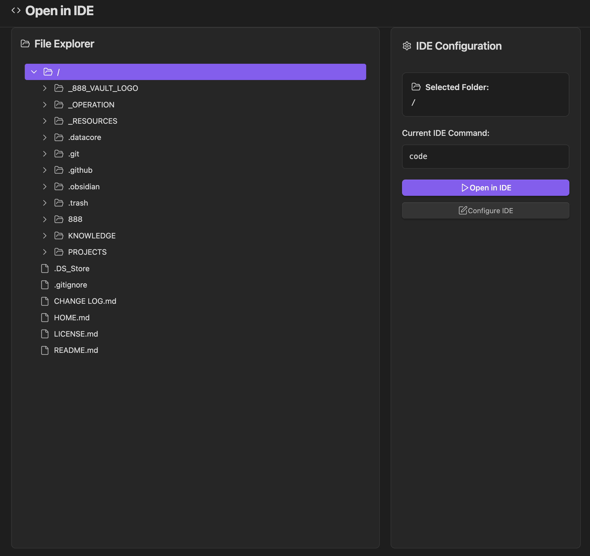

### Tab: Open IDE

- **Description**: A developer utility component that acts as a bridge between the Obsidian vault and the local file system, allowing users to open any file or folder directly in their preferred external code editor (like VS Code, Cursor, Neovim, etc.). It provides a dedicated, full-screen interface with a built-in file explorer to facilitate a seamless "edit externally" workflow.

- **Does**:
   
    - **Full Vault File Explorer**: Renders a complete, navigable file explorer that displays the entire folder and file structure of the user's Obsidian vault.    
    - **External Editor Integration**:
        - Spawns a system process to launch an external code editor, passing the absolute path of the selected file or folder as an argument.
        - Intelligently handles different command execution requirements for various operating systems (Windows, macOS, Linux) and editor types (GUI vs. terminal-based).
    - **IDE Configuration**:
        - Prompts the user to configure their IDE's shell command (e.g., code, cursor, nvim) on first use.
        - Persistently saves this command in localStorage, so it only needs to be configured once.
    - **Immersive Full-Tab UI**: Designed to run in a full-pane mode that takes over the entire Obsidian view, providing a dedicated, app-like interface for browsing the vault and launching the editor.

- **Can’t**:
   
    - **Run on Mobile or in a Browser**: This component is fundamentally dependent on Node.js modules (child_process, fs, path) to interact with the local file system and execute shell commands. It will only function in the desktop (Electron) version of Obsidian.    
    - **Function Without a Configured IDE**: The user must have their desired code editor installed on their system, and its command-line launcher must be accessible in their system's PATH for the component to work.
    - **Edit Files Directly**: The component acts only as a launcher. It does not have any file editing capabilities itself; all editing is done in the external application.
    - **Monitor External Changes**: It is a one-way bridge. It opens files externally but does not monitor them for changes or automatically reflect updates made in the external editor.

- **Disclaimer**:
   
    - This component is an advanced developer utility. Its primary purpose is to showcase deep integration with the user's local system by executing shell commands. It is not intended to be a perfectly polished or bug-free application and serves as a powerful example of what is possible rather than a finished tool.

----

### COMPONENTS

###### [Open IDE Viewer](D.q.openide.viewer.md)

###### [Open IDE Component](D.q.openide.component.md)
