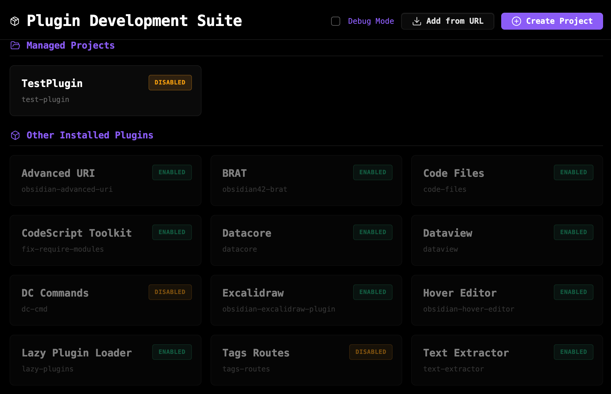
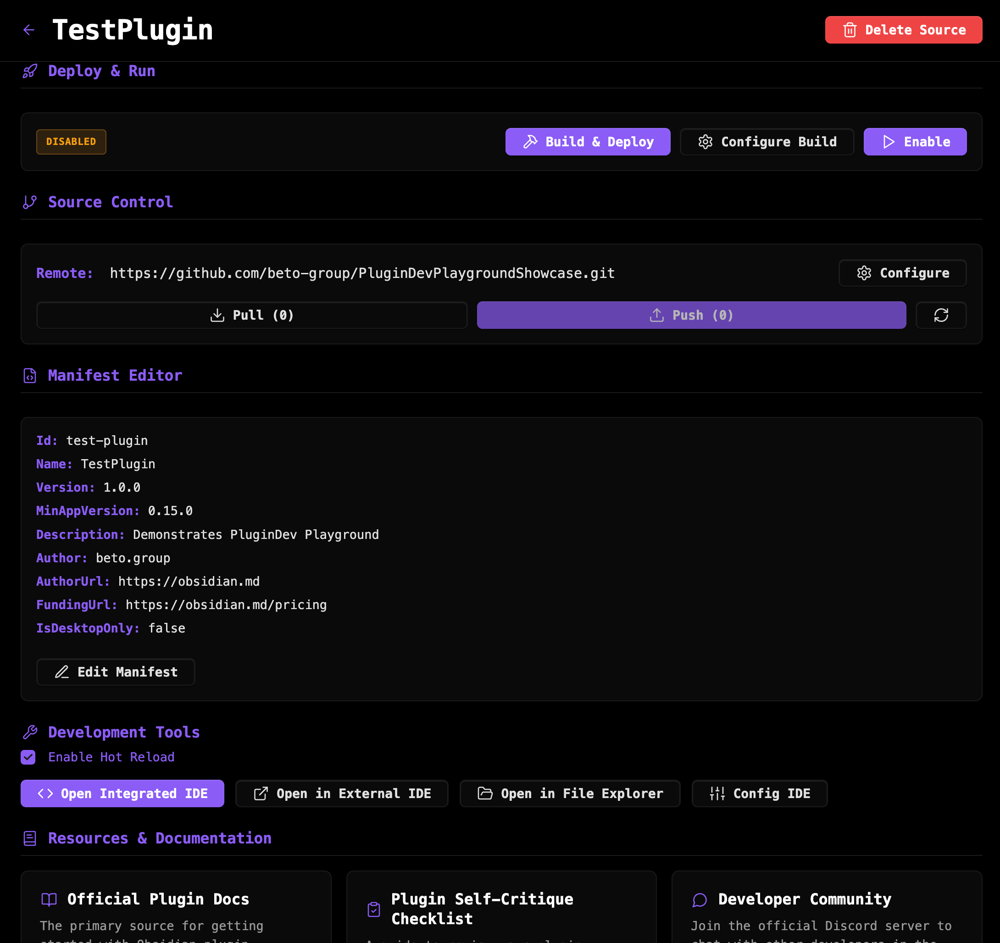
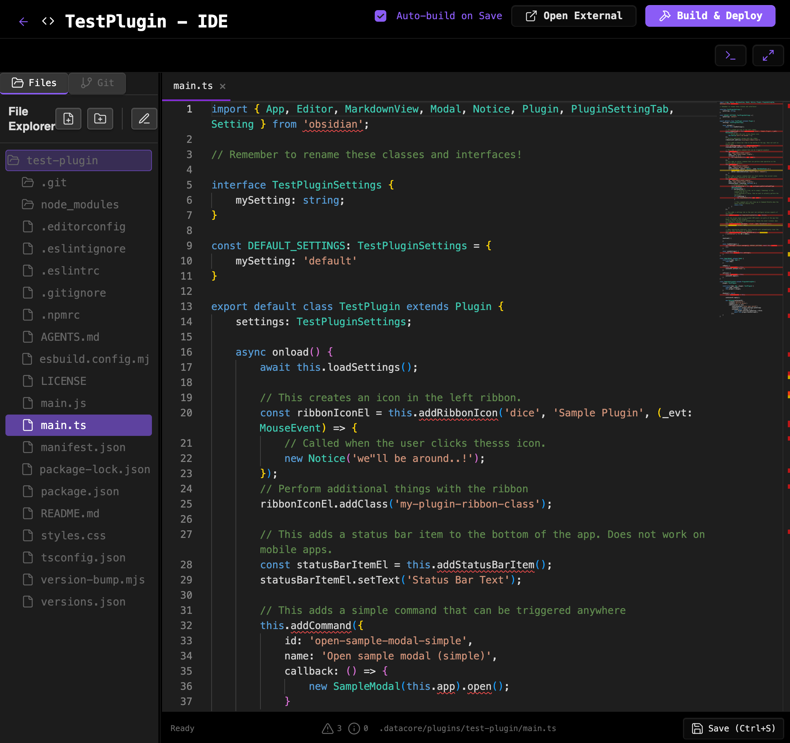

### Tab: Plugin Development Suite

- **Description**: A complete, self-contained Integrated Development Environment (IDE) for building Obsidian plugins, running entirely within a Datacore component. It provides a full suite of professional development tools, including a file explorer, a tabbed code editor with IntelliSense, an integrated terminal, a full-featured Git client, and an automated build-and-deploy pipeline. It is a powerful proof-of-concept demonstrating deep integration with the local file system and external processes.

- **Does**:

    - **Full Project & Plugin Management**:        
        - Provides a central dashboard to view and manage all "Managed Projects" (plugins developed within the suite) and other installed plugins.
        - **Project Scaffolding**: Can create new plugin projects from predefined templates (e.g., Default, Svelte) or by cloning any Git repository from a URL.
        - **File System Operations**: Allows for creating, renaming, moving, and deleting files and folders directly within the plugin's source directory.
    - **Integrated Code Editor (Monaco)**:
        - Features a powerful, tabbed code editor (the same engine as VS Code) hosted in an iframe for stability.
        - **IntelliSense & Autocompletion**: Automatically downloads TypeScript definition files for the Obsidian API and React, providing rich autocompletion and type-checking.
        - **Live Linter**: Includes a basic linter that provides real-time warnings and best-practice suggestions in the code.
    - **Complete Build & Deploy Pipeline**:
        - **Package Manager Detection**: Automatically detects and uses the correct package manager (npm, yarn, pnpm, bun) for a project.
        - **One-Click Build & Deploy**: A single button runs the plugin's build script and copies the necessary files (main.js, manifest.json, etc.) to Obsidian's live plugins folder.
        - **Auto-Build on Save**: An optional file watcher automatically triggers the build-and-deploy process whenever a source file is saved.
        - **Hot Reloading**: A separate file watcher monitors the deployed plugin folder and automatically reloads the plugin within Obsidian whenever its files change, enabling a seamless live-editing experience.
    - **Full-Featured Git Client**:
        - Integrates a complete graphical user interface for Git.
        - Supports all standard Git operations: init, status, staging/unstaging changes, commit, pull, push, creating and switching branches, merging, and configuring remote repositories.
        - Includes a visual commit history log.
    - **Integrated Terminal**:
        - Provides a multi-tabbed terminal that runs shell commands directly in the plugin's working directory, allowing for advanced operations and debugging.
    - **Immersive IDE Experience**: Designed to run in a full-pane mode, it hides the Obsidian status bar and provides a focused, app-like environment for development.

- **Can’t**:
   
    - **Run in Mobile or Browser Versions of Obsidian**: It fundamentally relies on Node.js modules (fs, child_process) for file system access and spawning processes, which are only available in the Electron-based desktop application.    
    - **Function Without External Dependencies**: The user must have **Node.js** and **Git** installed on their system and accessible in the system's PATH for most features (building, cloning, source control) to work.
    - **Provide a Perfect 1:1 Obsidian Preview**: While it can render other Datacore components in its preview pane, its primary function is code editing. It does not replicate Obsidian's markdown rendering.
    - **Guarantee Perfect Stability**: As a complex tool that interacts with the file system and spawns external processes, there is a potential for conflicts or unintended side effects.

- **Disclaimer**:
   
    - This component is a highly experimental and advanced proof-of-concept. Its primary purpose is to **showcase the absolute limits of Datacore's capabilities**, demonstrating deep integration with system processes and the local file system to create a professional-grade tool. It is not intended to be a perfectly polished or bug-free application. Users may encounter bugs, performance issues, or unexpected behavior. It serves as a powerful demonstration of what is possible rather than a finished, stable tool.

----

### COMPONENTS

###### [Plugin Dev Playground Viewer](D.q.plugindevsuite.viewer.md)

###### [Plugin Dev Playground Component](D.q.plugindevsuite.component.md)

