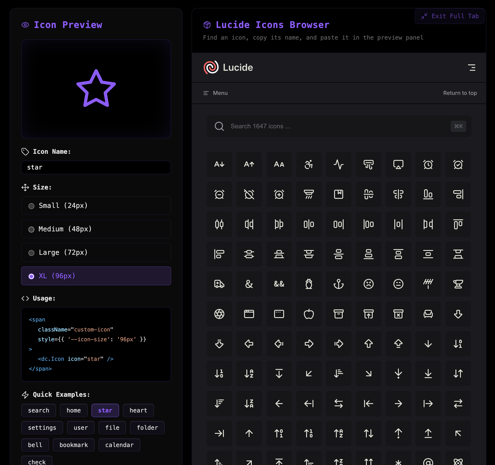

### Tab: Icons Pack

- **Description**: A developer and design utility that provides a comprehensive environment for exploring, previewing, and implementing icons from the built-in Lucide icon set available in Datacore. It combines a live preview panel with an embedded browser of the official Lucide library, creating a seamless workflow for finding and using icons.

- **Does**:
   
    - **Live Icon Preview**: Renders a large, clear preview of any icon from Datacore's <dc.Icon> component by simply typing its name.    
    - **Interactive Controls**: Allows users to dynamically change the preview size of the selected icon using a set of predefined radio buttons (Small, Medium, Large, XL).
    - **Code Snippet Generation**: Automatically generates a ready-to-use code snippet that shows how to implement the currently previewed icon with the selected size, making it easy to copy and paste directly into other components.
    - **Integrated Icon Browser**: Embeds the official Lucide icons website (lucide.dev/icons/) directly into the component within an iframe. This allows users to browse, search, and discover the full range of available icons without leaving Obsidian.
    - **Immersive Full-Tab UI**: Designed to run in a full-pane "Full-Tab Mode" that provides a two-panel, app-like experience for browsing and previewing, with a compact fallback mode for simple embedding in notes.

- **Can’t**:
   
    - **Use Custom Icon Sets**: The component is hard-coded to work with the Lucide icons bundled with Datacore's <dc.Icon> component. It cannot browse or preview custom SVG or font icon sets.    
    - **Directly Select Icons from the Browser**: The interaction is one-way; users must find an icon in the embedded browser and then manually type or paste its name into the preview panel's input field. It is not possible to click an icon in the iframe to select it.
    - **Function Fully Offline**: While the previewer will work offline if you know the icon's name, the integrated browser panel requires an active internet connection to load the Lucide website.
    - **Customize Color or Style**: The previewer only provides controls for the icon's name and size. It does not include options for changing color, stroke width, or other style properties, though these can be applied manually to the generated code snippet.

-----

### COMPONENTS

###### [Icons Pack Viewer](D.q.iconspack.viewer.md)

###### [Icons Pack Components](D.q.iconspack.component.md)
