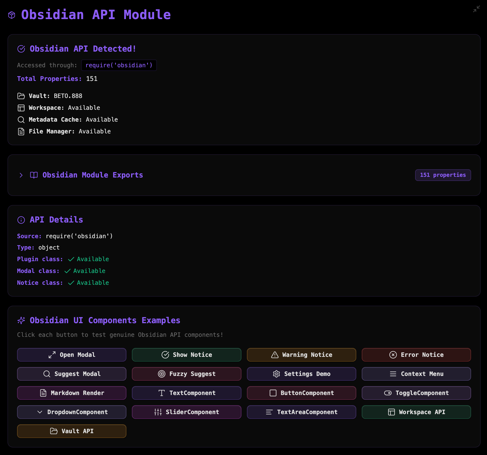

### Tab: Obsidian Suite Kit

- **Description**: A developer utility and interactive learning tool that provides a live exploration of the native Obsidian API. It inspects the global obsidian module and app object, lists all available properties, and offers a gallery of interactive buttons to demonstrate the functionality and appearance of core UI components like Modals, Notices, Settings panels, and more.

- **Does**:
   
    - **Live API Inspection**: Uses require('obsidian') to access the core API module and lists all of its exported properties and classes, providing developers with a comprehensive overview of the available tools.    
    - **Interactive Component Gallery**: Features a grid of buttons, where each button triggers a live demonstration of a native Obsidian UI component. This allows for direct interaction with:
        - **Modals**: Modal, SuggestModal, FuzzySuggestModal
        - **Notifications**: Notice
        - **UI Elements**: Setting, Menu, ButtonComponent, ToggleComponent, DropdownComponent, SliderComponent, TextAreaComponent
        - **Renderers**: MarkdownRenderer
    - **Contextual Information**: Displays key information about the current application context, such as the vault name and the availability of core managers like Workspace, FileManager, and MetadataCache.
    - **Immersive Full-Tab UI**: Designed to run in a full-pane mode that takes over the entire Obsidian view and hides the status bar, creating a focused, app-like environment for exploration and testing.
    - **Compact Mode**: Includes a compact mode for easy embedding within notes, with a button to enter the full experience.

- **Can’t**:
   
    - **Modify the API**: It is a read-only explorer and demonstration tool. It cannot change or extend the native Obsidian API.    
    - **Function Outside Obsidian**: Its entire purpose is to inspect the live require('obsidian') module and window.app object, which only exist within the Obsidian desktop application. It will not work in a browser or on mobile.
    - **Explore Plugin APIs**: It only explores the core Obsidian API. It cannot inspect the APIs of other installed community plugins.
    - **Provide In-Depth Documentation**: While it lists API properties and demonstrates UI components, it does not provide detailed documentation, usage examples (beyond the UI demos), or type definitions for them.

-----

### COMPONENTS

###### [Obsidian Suite Kit Viewer](D.q.obsidiansuitekit.viewer.md)

###### [Obsidian Suite Kit Components](D.q.obsidiansuitekit.component.md)
