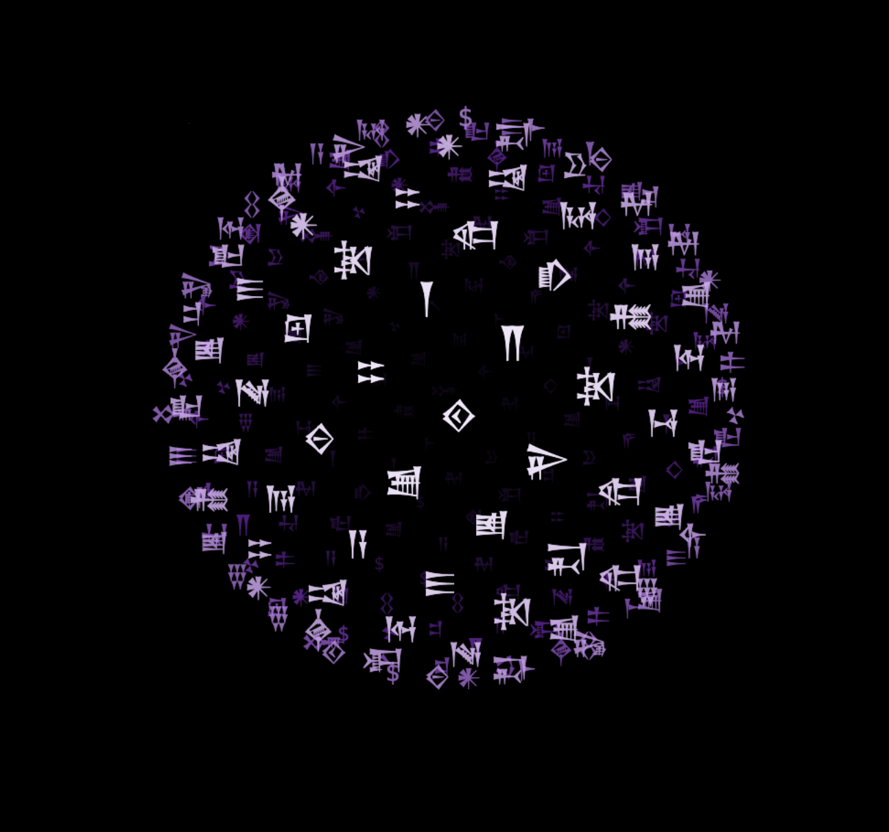

### Tab: Animated Sphere

- **Description**: A mesmerizing and highly performant visual component that renders an interactive 3D sphere composed of animated Cuneiform characters. It uses the HTML5 Canvas to create a sophisticated, pseudo-3D "ASCII art" effect that is both visually engaging and optimized for smooth performance.
   
- **Does**:

    - **Pseudo-3D ASCII Sphere**: Generates a sphere of points using a golden ratio distribution (Fibonacci sphere) and projects them onto a 2D canvas to create the illusion of a 3D object. Each point is rendered as a Cuneiform character from a predefined set.    
    - **Dynamic & Interactive Rotation**:
        - The sphere has a gentle, continuous base rotation.
        - Users can click and drag to "spin" the sphere, with the rotation speed and direction determined by the drag motion.
        - Includes a friction effect, so the sphere gradually slows down after being spun, and a momentum effect for quick "flicks."
    - **"Breathing" & "Living" Animation**:
        - The sphere gently expands and contracts in a subtle "breathing" animation, giving it a dynamic, organic feel.
        - On a set interval, individual characters on the sphere's surface have a small chance to randomly change to another character, creating a constantly evolving, "living" texture.
    - **Depth & Perspective Scaling**:
        - Correctly sorts all characters by their Z-depth, ensuring that characters in the front are drawn over those in the back.
        - Characters are scaled and their opacity is adjusted based on their distance from the virtual camera, enhancing the 3D effect.
    - **Performance Optimized**: The animation loop is throttled to a target FPS, and rendering calculations are batched to ensure a smooth experience even with hundreds of points.
    - **Immersive Full-Tab Mode**: Designed to run in a full-pane mode that takes over the entire Obsidian view, creating a focused and immersive visual experience, with a compact fallback option.

- **Can’t**:
   
    - **Display Custom Text or Data**: The characters on the sphere are randomly selected from a hard-coded set of Cuneiform symbols and do not represent any data from the vault or user input.    
    - **Be Customized via Props**: All visual parameters—such as the character set, colors, rotation speed, and number of points—are hard-coded within the component and cannot be changed through external properties.
    - **Render True 3D Geometry**: It is a 2D canvas-based effect that simulates 3D. It does not use WebGL and cannot render complex 3D models or textures.
    - **Support Text Selection**: As the characters are rendered on an HTML5 Canvas, they are graphical elements. The user cannot select, copy, or highlight them.

-----

### COMPONENTS

###### [Animated Sphere Viewer](D.q.animatedsphere.viewer.md)

###### [Animated Sphere Components](_RESOURCES/DATACORE/65%20AnimatedSphere/D.q.animatedsphere.component.md)
