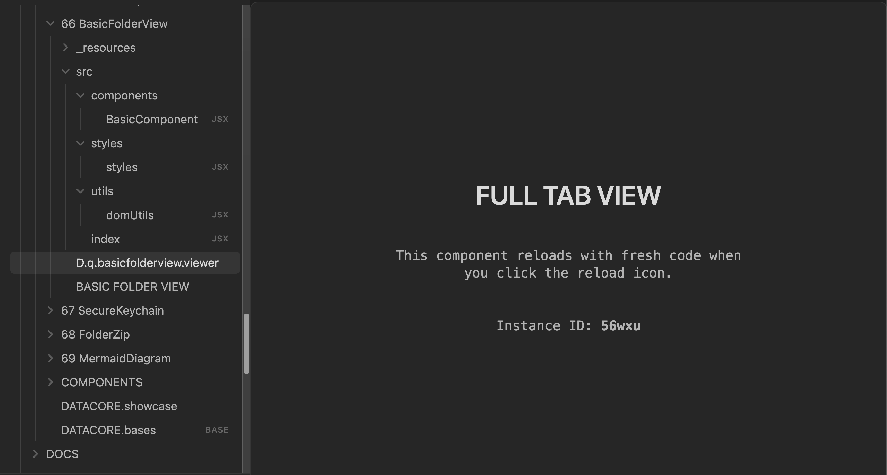

### Tab: Basic Folder View

- **Description**: A foundational template component designed for creating immersive, full-tab experiences within Obsidian. It handles the complexities of DOM manipulation required to break out of the standard markdown preview flow and occupy the entire pane, providing a clean slate for custom UI development.

- **Does**:
   
    - **Full-Pane Management**:    
        - **DOM Injection**: Automatically identifies the parent workspace leaf and injects itself to cover the full content area.
        - **Cleanup**: Handles proper cleanup and restoration of the original DOM state when the component is unmounted or the view is changed.
    - **Developer Experience**:
        - **Hot Reloading**: Includes a built-in reload mechanism to refresh the component without reloading the entire Obsidian app, speeding up development cycles.
        - **Scoped Styling**: Uses unique instance IDs to scope styles, preventing conflicts with other views or the Obsidian theme.
    - **Boilerplate Foundation**:
        - **Structure**: Provides a clear project structure with separate files for logic, styles, and utilities.
        - **React/Preact Integration**: Sets up the necessary React/Preact hooks and state management for building interactive UIs.

- **Can’t**:
   
    - **Persist State**: By default, it does not persist state across Obsidian restarts unless specifically implemented.
    - **Modify Vault Data**: As a base template, it doesn't perform any file operations out of the box.

- **Disclaimer**:

    - **Advanced Usage**: This component interacts directly with the DOM. While robust, changes to Obsidian's internal DOM structure in future updates could potentially affect its behavior.

-----

### COMPONENTS

###### [Basic Folder View Viewer](_RESOURCES/DATACORE/66%20BasicFolderView/D.q.basicfolderview.viewer.md)

###### [Basic Folder View Components {index.jsx}](_RESOURCES/DATACORE/66%20BasicFolderView/src/index.jsx)

