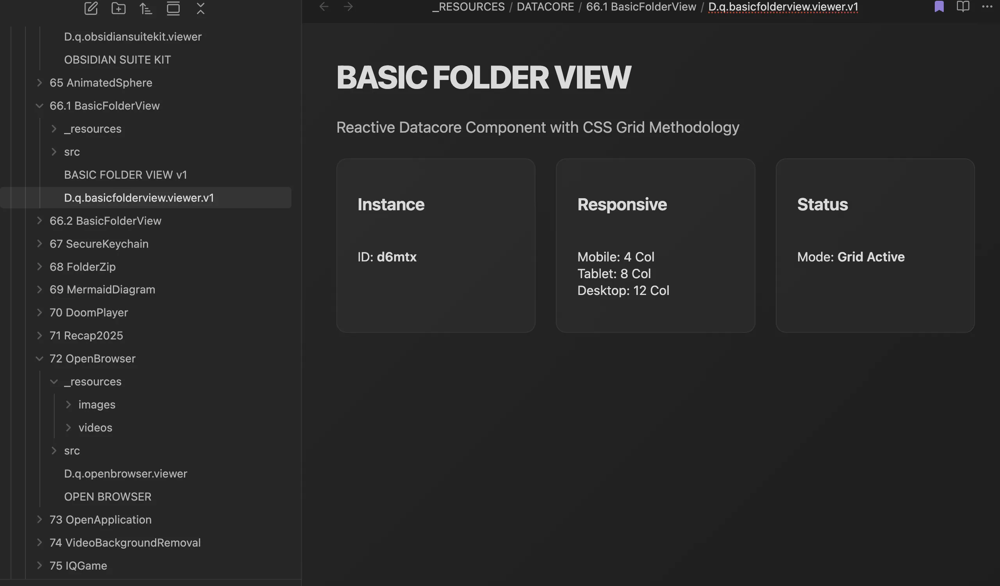

### Tab: Basic Folder View v1

- **Description**: A foundational template component designed for building immersive, full-tab experiences within Obsidian. It serves as a sterile boilerplate for developers to break out of the standard Markdown preview flow and occupy the entire pane with custom UI logic.

- **Does**:

    - **Full-Pane Management**:
        - Automatically identifies the parent workspace leaf and injects itself to cover the full content area.
        - **Cleanup Protocol**: Handles proper restoration of the original DOM state when the component is unmounted.
    - **Developer Utilities**:
        - **Hot Reloading**: Includes a built-in mechanism to refresh the component without reloading the entire application.
        - **Scoped Styling**: Utilizes unique instance IDs to prevent CSS conflicts with other views or themes.

- **Can’t**:

    - **State Persistence**: Does not persist UI state across restarts unless manually implemented by the developer.
    - **Vault Data**: As a base template, it performs no file operations or data mutations out of the box.

------

### Components
###### [Basic Folder View Viewer v1](D.q.basicfolderview.viewer.v1.md)
###### [Basic Folder View v1 Components {index.jsx}](_RESOURCES/DATACORE/66.1%20BasicFolderView/src/index.jsx)
