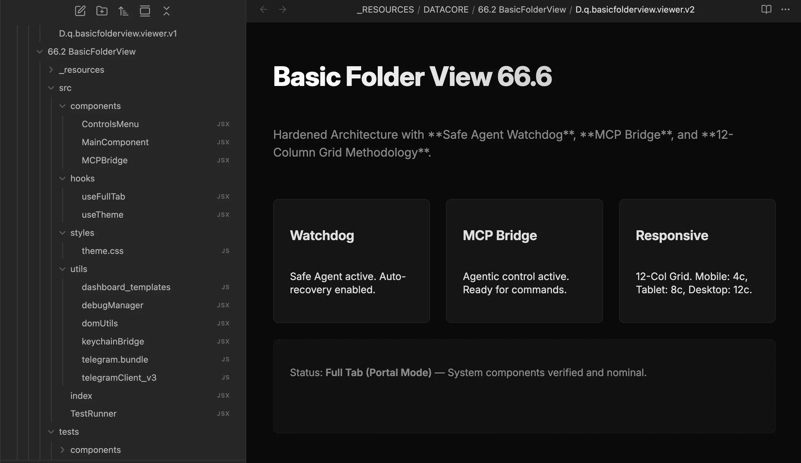

### Tab: Basic Folder View v2

- **Description**: Basic Folder View v2 is an evolution of the core boilerplate, featuring an industrial-grade instrumentation layer. It extends the immersive full-tab foundation with native Model Context Protocol (MCP) support, comprehensive unit testing via Vitest, and a synchronized Telegram prompting bridge.

- **Does**:

    - **Industrial Instrumentation**:
        - **Full-Pane Management**: Logic refined via custom `useFullTab` hooks for maximum responsiveness and modularity.
        - **MCP Integration**: Features a native command bridge for external interactivity and bi-directional communication.
    - **Verification & Control**:
        - **Stability Proving**: Includes a `vitest` test suite to verify UI integrity across Obsidian updates.
        - **Terminal Synchronization**: Integrates a Telegram prompt bridge for remote lifecycle management.

- **Can't**:

    - **Auto-Sync**: Does not automatically sync test results to cloud-mesh without the `beto-nexus` plugin active.
    - **Environment Execution**: Requires the Datacore environment for bridge initialization and MCP protocol synchronization.

------

### Components
###### [Basic Folder View Viewer v2](D.q.basicfolderview.viewer.v2.md)
###### [Basic Folder View v2 Components {index.jsx}](src/index.jsx)
