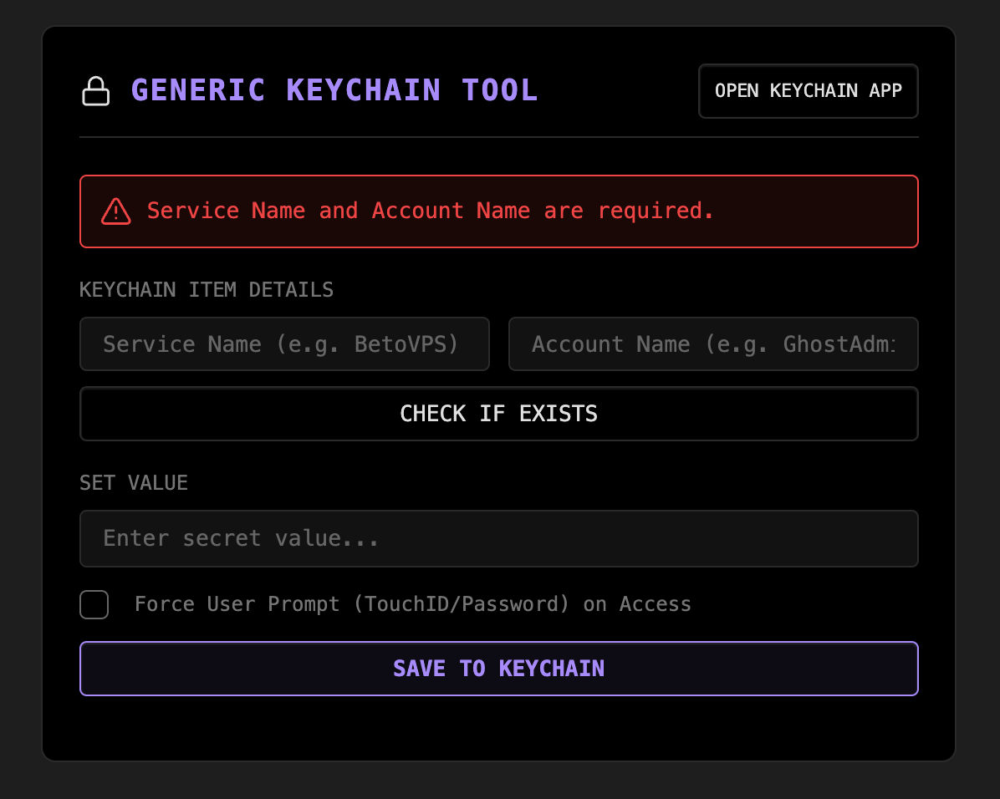

### Tab: Secure Keychain

- **Description**: A secure utility component that provides a graphical interface for interacting directly with the native macOS Keychain. It allows users to store, retrieve, and manage sensitive information like API keys or passwords using the operating system's secure storage, leveraging system-level security features such as Touch ID and password prompts.

- **Does**:   
    - **Direct Keychain Integration**: Uses Node.js child_process to execute the native macOS security command-line tool for all operations.
    - **CRUD Functionality**:
        - **Save**: Securely adds or updates a generic password entry in the Keychain for a specified service and account name.
        - **Check Status**: Verifies if a Keychain entry exists without retrieving the secret, preventing unnecessary system prompts.
        - **Reveal Secret**: Fetches and displays the stored secret. This action typically triggers a macOS security prompt (Touch ID or password) for user authentication.
        - **Delete**: Permanently removes a key from the Keychain after a confirmation prompt.
    - **Enhanced Security Control**: Includes an option to "Force User Prompt on Access," which configures the Keychain item to require user authentication every time it is accessed, regardless of application trust settings.
    - **System Integration**: Provides a shortcut button to open the native "Keychain Access.app," allowing users to view and manage their stored secrets directly in the macOS interface.
    - **Clear User Feedback**: A dedicated status panel provides real-time updates on the status of operations (idle, loading, success, or error), including detailed messages from the security tool.
- **Can’t**:
    - **Run on non-macOS Systems**: This component is **macOS-exclusive**. It will fail to operate on Windows, Linux, iOS, or Android because it relies on the security command-line tool, which only exists on macOS.
    - **Sync Across Devices**: Data is stored in the local macOS Keychain on a single machine. It does not and cannot sync via Obsidian Sync or any other cloud service.
    - **Function in Sandboxed Environments**: Requires access to the Node.js child_process module, meaning it will only work in a standard desktop installation of Obsidian and not in restricted or web-based environments.
    - **Manage Complex Access Control**: While it can set a "force prompt" policy, it cannot manage more granular Access Control Lists (ACLs), such as whitelisting specific applications. This must be done through the native Keychain Access app.
    - **Batch Import or Export**: The interface is designed for managing individual keys one at a time and does not include any functionality for bulk operations.

----

### COMPONENTS

###### [Secure Keychain Viewer](_RESOURCES/DATACORE/67%20SecureKeychain/D.q.securekeychain.viewer.md)

###### [Secure Keychain Components](_RESOURCES/DATACORE/67%20SecureKeychain/D.q.securekeychain.component.md)

