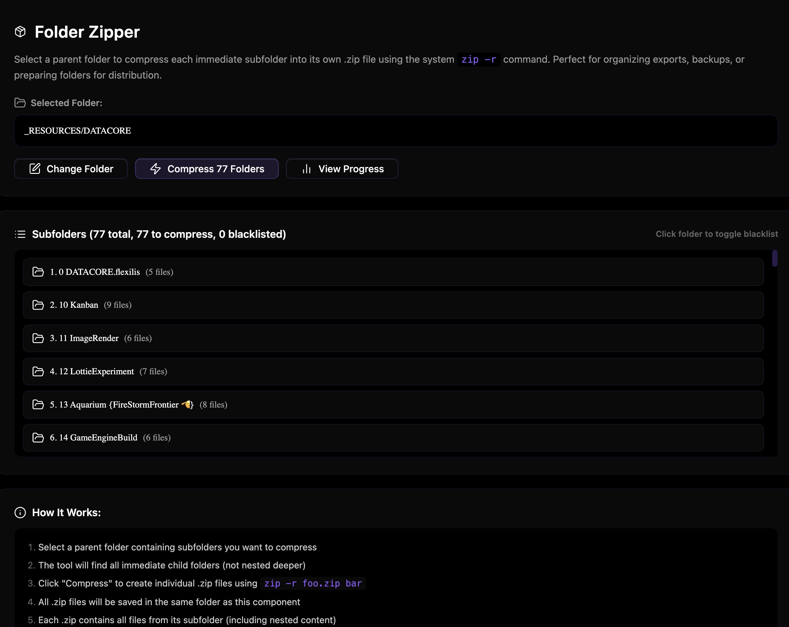

### Tab: Folder Zipper

- **Description**: An efficient, automated batch compression tool designed for backing up or distributing folder structures. It allows users to select a parent folder and automatically compresses every immediate subfolder into its own individual `.zip` archive. It provides a clean UI for managing the process, including blacklisting specific folders and viewing a detailed progress log.

- **Does**:

    - **Batch Compression**:
        - **Target Selection**: Opens a searchable folder picker to choose a parent directory.
        - **Smart Scanning**: Identifies all immediate subfolders and calculates the file count for each.
        - **Automation**: Iterates through the list and executes the system's `zip -r` command for each subfolder, creating a standalone archive.
    - **Interactive Management**:
        - **Blacklisting**: Users can click any subfolder in the list to toggle it as "Blacklisted," preventing it from being compressed during the batch run.
        - **Progress Tracking**: Features a real-time progress modal with a visual bar and a detailed log of every success or failure.
    - **System Integration**:
        - **Native Performance**: Uses Node.js `child_process` to spawn the native `zip` command for maximum speed and compatibility.
        - **Output Management**: Automatically saves all generated zip files to a dedicated `zip/` subdirectory relative to the component.
    - **Immersive UI**: Designed for **Full-Pane Mode** to provide a dashboard-like experience for managing large archiving tasks.

- **Can’t**:

    - **Environment Restriction**: Strictly requires the Node.js environment and a system-level `zip` binary; does not function on mobile.
    - **File Filtering**: Operates on entire subfolders; does not support selecting individual files for zipping.
    - **Security**: Current version does not support password protection or encryption layers.
    - **System Tools**: If the `zip` command is not in the system's PATH, the operation will fail.

> [!CAUTION]
> **System Dependency**: This tool executes shell commands (`zip`). Ensure your system has the necessary command-line tools installed and accessible. On Windows, this typically requires installing Git Bash or adding 7-Zip to your PATH.

------

### Components
###### [Folder Zip Viewer](D.q.folderzip.viewer.md)
###### [Folder Zip Components {index.jsx}](D.q.folderzip.component.md)
