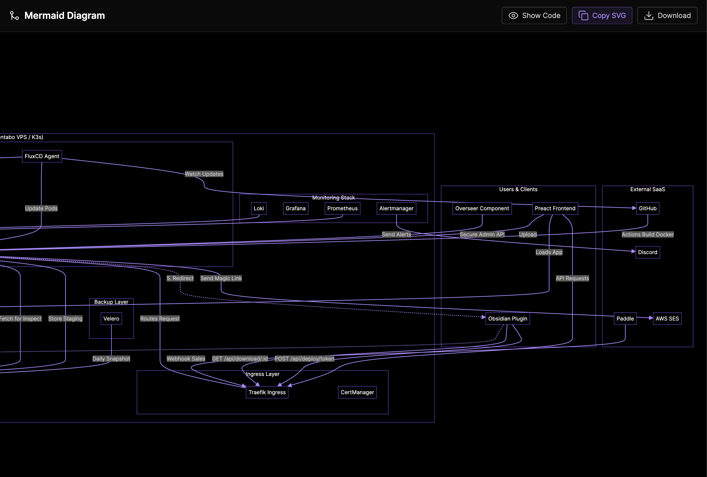

### Tab: Mermaid Diagram Editor

- **Description**: A powerful, self-contained environment for creating, editing, and interacting with Mermaid diagrams directly within Obsidian. It features a split-pane layout with a live code editor and a real-time preview that supports advanced pan and zoom interactions. The component handles the dynamic loading of the Mermaid library and provides utilities for exporting your creations as SVG files.

- **Does**:   
    - **Live Diagram Editing**:
        - **Split Interface**: Features a resizable layout with a raw text editor for Mermaid syntax and a live preview pane.
        - **Syntax Feedback**: Includes a built-in error reporter that highlights syntax issues in real-time.
        - **Example Library**: Provides one-click access to templates for Flowcharts, Sequence Diagrams, Class Diagrams, State Charts, Gantt charts, and Pie charts.
    - **Interactive Preview**:
        - **Pan & Zoom**: Implements a robust system allowing users to pan (drag) and zoom (scroll wheel) to navigate large, complex diagrams easily.
    - **Export Tools**:
        - **Copy SVG**: Instantly copies the generated SVG code to the clipboard for use elsewhere.
        - **Download**: Saves the current diagram as a standalone .svg file to your computer.
    - **Self-Contained Architecture**:
        - **Dynamic Loading**: Fetches and caches the mermaid.js library from a CDN on first run, ensuring it works offline subsequently.
        - **Full-Tab Mode**: Expands to fill the entire pane for a distraction-free editing experience.

- **Can’t**:
   
    - **Render Non-Mermaid Syntax**: Strictly limited to the Mermaid diagramming language. It cannot render Graphviz, PlantUML, or other diagram formats.    
    - **Auto-Save to File**: Edits are currently session-based or require manual copying. It does not automatically bind to a specific .md file in the vault for auto-saving changes (unless extended).
    - **Function Offline (First Run)**: Requires internet access initially to fetch the Mermaid library.

---

### COMPONENTS

###### [Mermaid Diagram Viewer](_RESOURCES/DATACORE/69%20MermaidDiagram/D.q.mermaiddiagram.viewer.md)

###### [Mermaid Diagram Components](_RESOURCES/DATACORE/69%20MermaidDiagram/D.q.mermaiddiagram.component.md)

