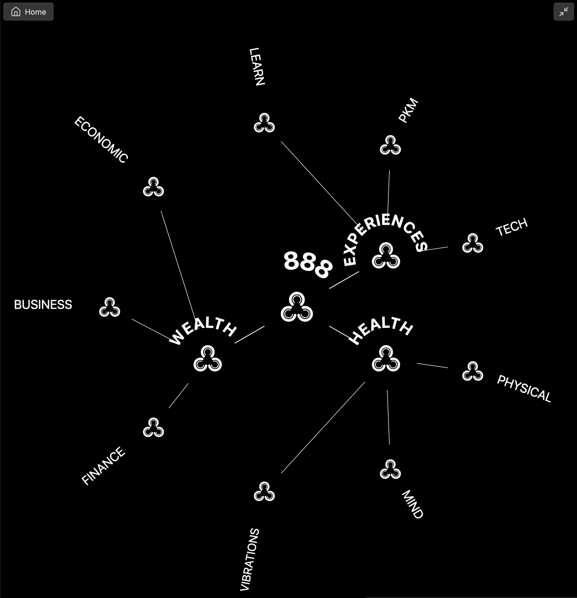

### Tab: Bounty View

- **Description**: A highly sophisticated, interactive radial menu designed for exploring hierarchical knowledge bases. It visualizes note connections and headers as a multi-ring constellation, offering an immersive, game-like navigation experience. The component intelligently distributes nodes using advanced geometry and supports deep traversal of linked content.

- **Does**:
   
    - **Radial Hierarchy Visualization**:        
        - Renders the current context as a **Central Node**.
        - **Ring 2**: automatically populates with specific headers (H6) from the current file.
        - **Ring 3**: dynamically fetches and renders the children or sub-headers of the items in Ring 2, creating a multi-level view of the content structure.
    - **Smart Geometric Layout**:
        - Utilizes complex geometric calculations (angleDiff, pickClosestSlot) to evenly distribute nodes across the rings, minimizing visual clutter and ensuring a balanced, aesthetic presentation.
        - Features dynamic label scaling and positioning logic to ensure text remains legible regardless of the node's position on the circle.
    - **Interactive Navigation**:
        - **Drill-Down**: Clicking an outer node centers the view on that topic, loading the corresponding file (specifically looking for .namzu or .enigmas extensions) and regenerating the rings.
        - **History Navigation**: Maintains a navigation stack, allowing users to "go back" to previous layers using a middle-click or the Home button.
    - **Immersive Full-Tab Experience**:
        - Includes a ScreenModeHelper-style logic to dynamically reparent the view, allowing it to take over the entire Obsidian workspace leaf for a distraction-free interface.
    - **Dynamic Asset Integration**:
        - Integrates with a helper component (ImagesPlaceholder) to dynamically fetch and render SVG icons for each node based on its name, falling back to a styled logo if no specific icon is found.

- **Can’t**:
   
    - **Edit Content**: This is strictly a navigational viewer. Users cannot rename headers, move nodes, or edit note content from within the radial view.        
    - **Display Body Text**: It abstracts the file content into structure (headers/titles). It does not display the actual body text of the notes.
    - **Work Universally**: The current logic is heavily tailored to a specific vault structure, relying on H6 headers and specific file extensions (.namzu). It would require modification to work with standard Markdown structures.

- **Disclaimer**:
   
    - This component acts as a specific interface for the "Bounty" or "Enigma" system within the vault. Its navigation logic relies on specific naming conventions and header levels (H6) used in that dataset.

----

### Components

###### [Bounty View Viewer](D.q.bountyview.viewer.md)

###### [Bounty View Component](D.q.bountyview.component.md)