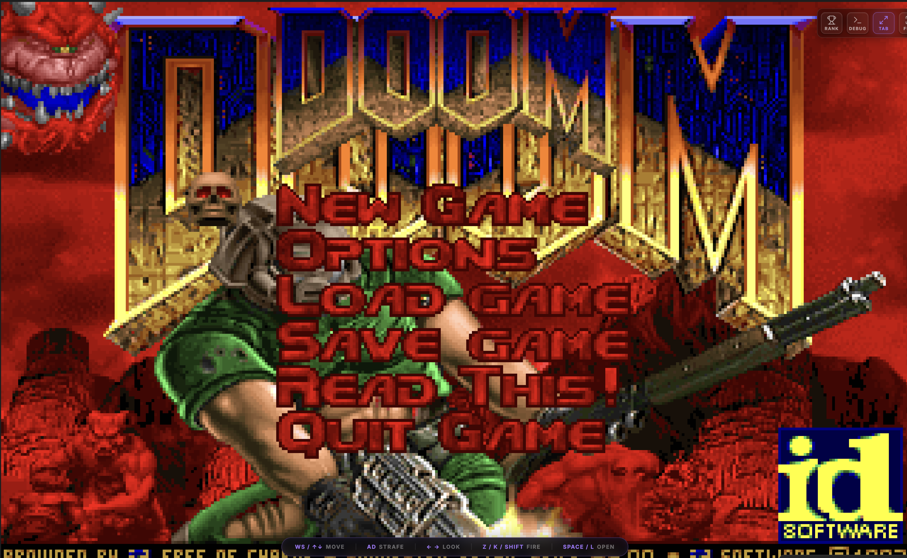

### Tab: Doom Player

- **Description**: A fully-featured, high-performance port of the classic game Doom that runs natively inside Obsidian using a custom WebAssembly (WASM) engine. More than just a game, this component is a powerful development tool featuring an automatic, heuristic-based memory scanner for live stat tracking and a sophisticated external diagnostics window for real-time memory hacking and debugging.
   
- **Does**:

    - **One-Click Installation**: Features a self-contained installer that, on first run, automatically downloads the necessary WASM binary (~3MB, with the shareware WAD embedded) and stores it locally within the vault's file system in a hidden .doom-assets directory.
    - **Full Gameplay Experience**: Provides a complete, high-performance Doom experience directly in the Obsidian canvas, including pixel-perfect rendering, sound effects, and looping music. It employs an aggressive event capture system to isolate all keyboard inputs, ensuring seamless control without interference from Obsidian's native hotkeys.    
    - **Automatic Stat Tracking & Leaderboard**:
        - A background memory scanner runs alongside the game, heuristically identifying the memory addresses for game state variables (like gametic).
        - Automatically detects when a level is completed (by listening for specific sound cues or monitoring score changes) and captures the final stats (Kills, Secrets, Time).
        - Saves these stats to a local scores.json file, creating a persistent, viewable leaderboard of the user's best runs.
    - **Advanced External Debugging Window**:
        - Can open a **separate, native OS winzow** that serves as a powerful diagnostics and memory hacking tool.
        - This external window communicates directly with the WASM instance and provides:
            - A **Memory Hunter** to search for specific values (e.g., find all addresses containing the value 100 to locate health).
            - A live **Hex Inspector** to view and navigate the game's entire memory space.
            - A **Watchlist** to monitor changes to specific memory addresses in real-time.
            - The ability to **write new values** to memory (e.g., set health to 999) and **freeze values** (e.g., lock ammo).
            - A **Cheat Panel** to inject keystrokes for classic codes like iddqd and idkfa.
    - **Multiple Screen Modes**: Includes on-screen controls to switch between the default full-pane view (Full Tab) and a true system-level Fullscreen mode for maximum immersion.

- **Can’t**:
   
    - **Load Custom WADs**: The asset manager is hard-coded to download a specific WASM binary with the shareware WAD embedded. It does not provide a mechanism for loading other WAD files (e.g., DOOM2.WAD or custom community levels).    
    - **Save or Load Game Progress**: The component does not implement functionality to save or load an in-progress game. Persistence is limited to the end-of-level leaderboard scores.
    - **Music Issues**: No music comes out sadly
    - **Run the Debug Window on Mobile/Web**: The external diagnostics window relies on Electron APIs (BrowserWindow, ipcRenderer) and can therefore only be launched on desktop versions of Obsidian (Windows, macOS, Linux).
    - **Guarantee Stat-Tracking Stability**: The memory scanner uses heuristics to find game variables. While robust, it is possible for this system to fail or report incorrect stats if the underlying WASM binary is ever changed.

-----

### Components

###### [Doom Player Viewer](_RESOURCES/DATACORE/70%20DoomPlayer/D.q.doomplayer.viewer.md)

###### [Doom Player Component](_RESOURCES/DATACORE/70%20DoomPlayer/D.q.doomplayer.component.md)

