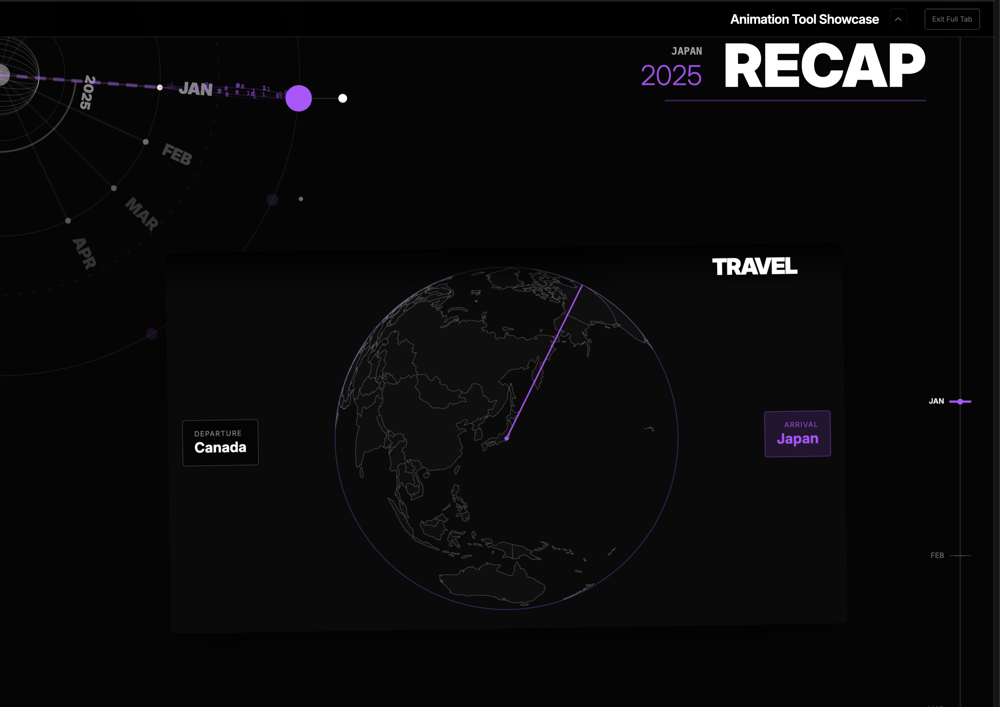

### Tab: Recap 2025

- **Description**: An advanced data visualization and storytelling engine designed to transform structured chronological data (like yearly recaps or project timelines) into an immersive, high-fidelity interactive experience. It functions as a real-time cinematic renderer, turning standard Markdown into a premium, auto-playing visual journey.

- **Does**:

    - **Cinematic Automation**:
        - **AutoPlay Mode**: Orchestrates a hands-free, full-screen narrative journey, automatically navigating between milestones and building scenes without user input.
        - **Smart Sequencing**: Intelligently calculates scene duration based on content type (e.g., lingering longer on videos than text) and auto-plays associated media.
        - **Zero-UI Immersion**: Automatically retracts navigation headers and controls during playback to focus entirely on the visual content.
    - **Orbital Node Graph**:
        - Visualizes the timeline as an interactive 3D orbital network. "Months" act as gravity wells, while individual media items orbit like "moons."
        - Features **Dynamic Fibers** that visualize connections between events with pulsing particle data.
    - **Intelligent Parsing**:
        - **Markdown-Driven**: Reads a simple `recap.md` file to define complex hierarchies.
        - **Feature Detection**: Automatically scans bullet points for specific metadata triggers (e.g., Flight Paths, Timestamps, Reactions).
    - **Specialized Visual Modules**:
        - **GlobeTravel**: A fully interactive 3D planetary visualization for geographic transitions.
        - **AutoScrollWebview**: An integrated browser view that automatically scrolls through linked web content during the animation flow.

- **Can’t**:

    - **Export as Video**: While it looks and feels like a video production, it is a live code render. It cannot be natively exported as an `.mp4` file without using screen recording software.
    - **Edit Data Live**: This is strictly a visualization engine; it does not provide an interface to edit the source `recap.md` file. All changes must be made in the source Markdown.
    - **Hardware Performance**: The combination of 3D Globes, particle systems (EmojiRain), and complex DOM animations is resource-intensive and may lag on older devices or mobile browsers.
    - **Parse Unstructured Data**: The engine relies heavily on a strict Markdown hierarchy (Year > Month > Item). Deviating from this structure will break the visualization.

------

### Components
###### [Recap 2025 Viewer](D.q.recap2025.viewer.md)
###### [Recap 2025 Components {index.jsx}](_RESOURCES/DATACORE/71%20Recap2025/src/index.jsx)
