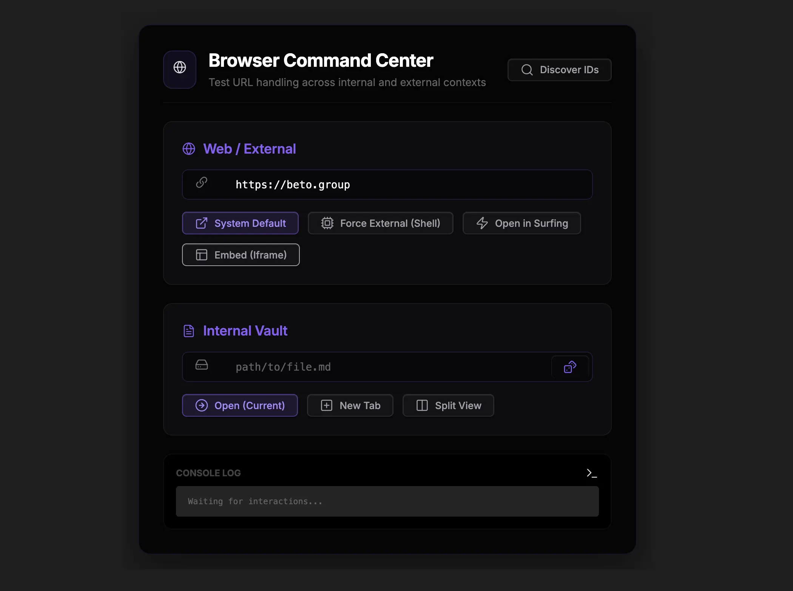

### Tab: Open Browser

- **Description**: Open Browser is a comprehensive utility designed to test and streamline how URLs and internal links are handled within Obsidian. It provides a tactical command center to discover available browser-related commands, force external shell execution, or embed web content directly via iframes for immediate preview.

- **Does**:

    - **External Web Support**: Open URLs in system defaults or force Electron external shell execution for interception testing.
    - **Internal Vault Navigation**: Test internal links in current tabs, new tabs, or split views with random file picking.
    - **Surfing View Integration**: Directly launch URLs into internal "Surfing" plugin views for deep ecosystem integration.
    - **Iframe Embedding Toggle**: Preview web content directly within the component interface without context switching.
    - **Command ID Discovery**: Scans the Obsidian environment for browser-related commands and logs them to a terminal HUD.
    - **Real-Time Tactical Logging**: Built-in logger tracks execution attempts, errors, and discovery results for debugging.

- **Can't**:

    - **Bypass Content Security (CSP)**: Subject to Obsidian and remote target security policies which may block embedding.
    - **Native Component Transformation**: Does not convert arbitrary web applications into native Obsidian modules.
    - **Advanced Non-MD Previewing**: Internal link tester is optimized for Markdown; lacks rich previews for binary assets.

------

### Components
###### [Open Browser Viewer](D.q.openbrowser.viewer.md)
###### [Open Browser Components {index.jsx}](src/index.jsx)
