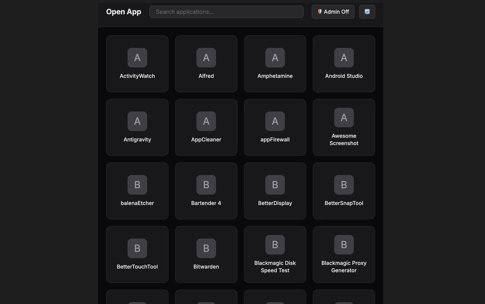

### Tab: Open Application

- **Description**: Open Application is a high-performance system bridge designed to unify the Obsidian knowledge base with the macOS desktop environment. It provides a tactical interface for rapid application discovery and execution, utilizing Electron-native APIs to maintain uninterrupted cognitive flow during deep transitions.

- **Does**:

    - **Dynamic System Scanning**: Automatically indexes the `/Applications` directory in real-time for immediate access to new installs.
    - **Admin Elevation Support**: Built-in `osascript` bridging for launching system tools requiring elevated `sudo` privileges.
    - **Detached Lifecycle Spawning**: Applications run as independent processes, persisting beyond the Obsidian session.
    - **High-Speed Fuzzy Search**: Implements a dedicated filtering engine for instantaneous localized application lookup.
    - **Visual Glassmorphic Grid**: Responsive interface with premium hover states and interactive application cards.
    - **Real-Time Notice HUD**: Integrated status feedback system for confirmation of successful launches or diagnostics.

- **Can't**:

    - **Direct File Manipulation**: Strictly optimized for `.app` bundle execution; does not support opening arbitrary documents.
    - **Custom Name Aliasing**: Relies on system-defined application identities; manual UI-based renaming is not supported.
    - **Advanced Taxonomy Filtering**: Currently lists entries alphabetically; functional categorization is pending update.

------

### Components
###### [Open Application Viewer](D.q.openapplication.viewer.md)
###### [Open Application Components {index.jsx}](_RESOURCES/DATACORE/73%20OpenApplication/src/index.jsx)
)
