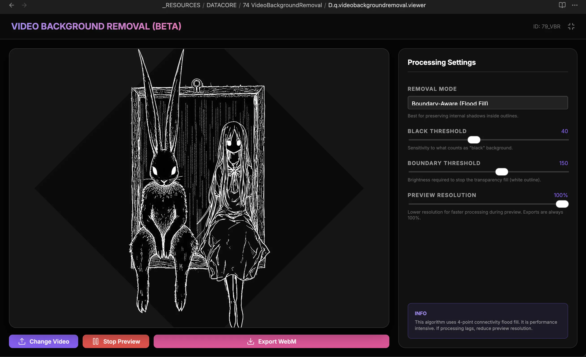

### Tab: Video Background Removal

- **Description**: A specialized client-side video processing utility that removes black backgrounds from uploaded videos while preserving internal shadows. Utilizing HTML5 Canvas and a boundary-aware flood fill algorithm, it extracts foreground elements and generates transparent WebM exports.

- **Does**:

    - **Boundary-Aware Flood Fill**: Implements a 4-point connectivity algorithm that respects bright boundaries to preserve internal dark areas during extraction.
    - **High-Speed Luma Key**: Features a rapid processing mode for removing black pixels based on a global luminosity threshold.
    - **Interactive Threshold Tuning**: Allows real-time adjustment for "Black Threshold" and "Boundary Detection" sensitivity.
    - **Dynamic Resolution Scaling**: Supports preview processing at lower resolutions (10%-100%) to optimize performance on complex frames.
    - **Direct Drag-and-Drop Ingress**: Enables loading local video assets through native file pickers or direct workspace dragging.
    - **Transparent WebM Export**: Records canvas streams directly to high-fidelity transparent video files for external use.

- **Can’t**:

    - **Hardware Acceleration**: Processing is strictly CPU-bound on the Canvas API; performance scales with resolution.
    - **MP4 Transparency**: Limited to WebM format due to browser restrictions on alpha-channel MP4 recording.
    - **Audio Channel Preservation**: Frames are processed visually; current implementation does not merge or export audio.

------

### Components
###### [Video Background Removal Viewer](D.q.videobackgroundremoval.viewer.md)
###### [Video Background Removal Components {index.jsx}](_RESOURCES/DATACORE/74%20VideoBackgroundRemoval/src/index.jsx)
