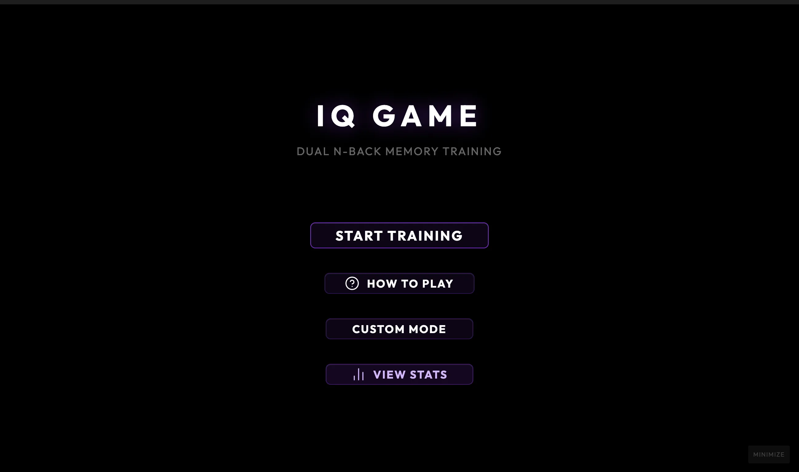
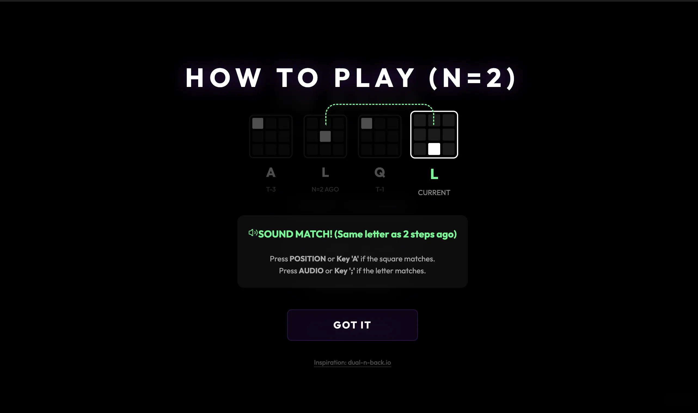
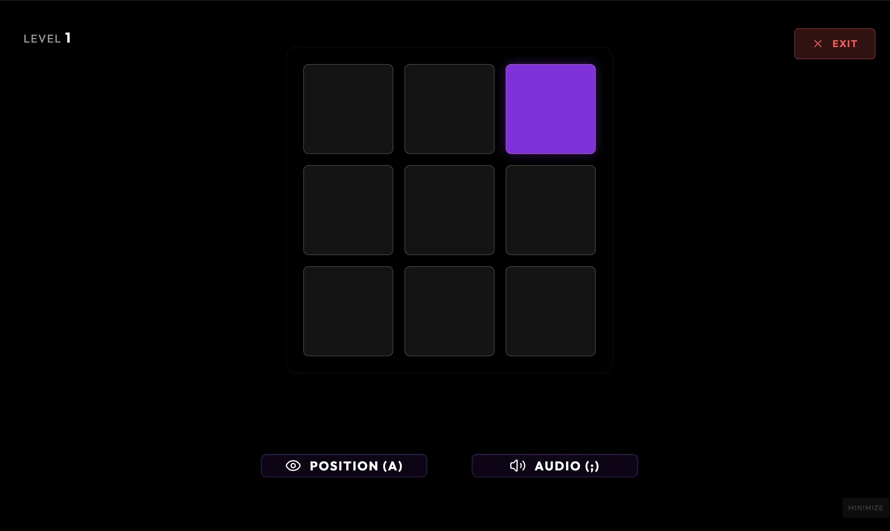

### Tab: IQ Game

- **Description**: IQ Game is a professional Dual N-Back working memory trainer designed for cognitive enhancement. Inspired by scientific performance protocols, it challenges users to simultaneously track visual positions on a 3x3 grid and auditory stimuli with adaptive difficulty mapping and real-time analytics.

- **Does**:

    - **Dual N-Back Training**: Simultaneous tracking of visual grid positions and multi-modal spoken letter cues.
    - **Adaptive Difficulty Engine**: Automatically adjusts N-levels based on performance (80% accuracy for level-up).
    - **Quantum Performance Analytics**: Calculates real-time hits, misses, false alarms, and D-prime sensitivity scores.
    - **Processing Speed Tracking**: Precision monitoring of user reaction times across visual and auditory match vectors.
    - **Persistent Progress Ledger**: Saves session data (N-level, score, timestamp) directly to the vault.
    - **Immersion Workflow**: Full-tab training mode that eliminates distractions and optimizes the UI for cognitive focus.

- **Can't**:

    - **External Audio Integration**: Uses system-native Speech Synthesis (TTS); does not support custom audio file uploads.
    - **Flexible Grid Topologies**: Optimized for standard 3x3 patterns; custom board sizes are currently unsupported.
    - **Decentralized Progress Sync**: Progress is localized to the Obsidian vault; requires manual sync for cross-device usage.

----

### Components
###### [IQ Game Viewer](D.q.iqgame.viewer.md)
###### [IQ Game Components {index.jsx}](src/index.jsx)
