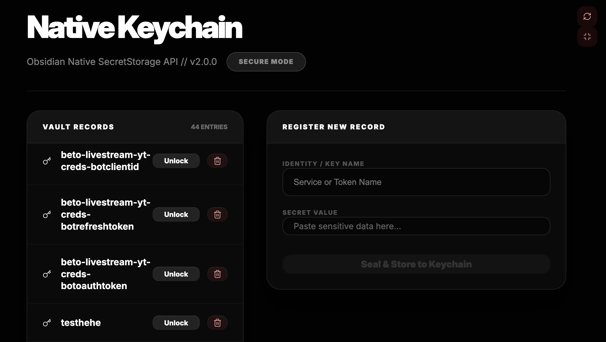

### Tab: Keychain Manager

- **Description**: Keychain Manager is a robust security utility that leverages Obsidian's Native SecretStorage API to manage credentials with OS-level encryption (DPAPI/Keychain). It provides a high-visibility interface to manage sensitive tokens and migrates unsecured secrets from plain-text storage into the secure system keyring.

- **Does**:

    - **Native OS-Level Security**: Direct integration with standard secure credential stores (macOS Keychain, Windows DPAPI).
    - **Auto-Identity Encryption**: Automatically encrypts credentials using the host system's user identity to prevent unauthorized extraction.
    - **Unsecured Secret Scanner**: Scans local vault storage for sensitive text patterns and potential token leakage.
    - **One-Click Migration Bridge**: Seamlessly moves discovered plain-text secrets into the secure native keyring with minimal friction.
    - **Global Record Registry**: Centralized dashboard for registered vault secrets with simplified "Unlock" and "Seal" workflows.
    - **Immersive Admin UI**: Edge-to-edge full-pane dashboard designed for high-security vault configuration and secret management.

- **Can't**:

    - **Cross-Device Native Syncing**: Secrets are hardware-bound to the local OS keychain and cannot be synced via Obsidian Sync.
    - **Host Security Bypass**: Requires active OS-level authentication; cannot reveal secrets if the system account is locked.
    - **Direct Binary Blob Storage**: Optimized for string-based tokens; binary data must be base64 encoded for archival.

------

### Components
###### [Keychain Manager Viewer](D.q.keychainmanager.viewer.md)
###### [Keychain Manager Components {index.jsx}](src/index.jsx)
