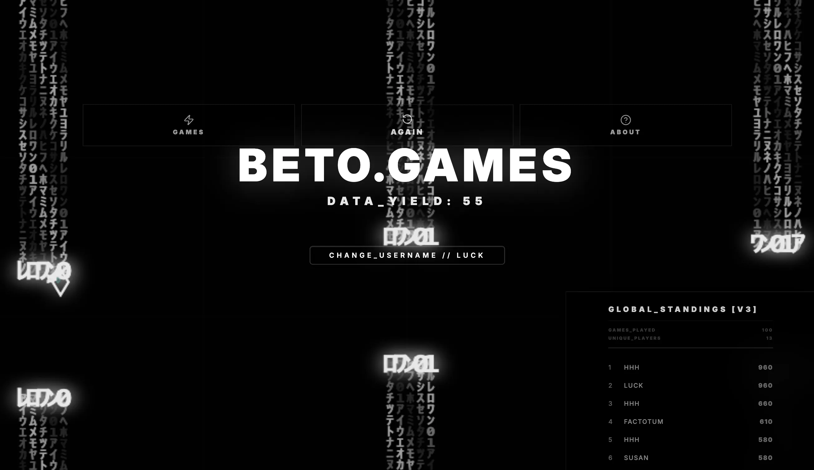

### Tab: Retro Morph Game

- **Description**: Retro Morph Game is a dynamic multi-mode arcade engine that seamlessly morphs between classic game genres (Snake, Flappy Bird, Dino Run) based on score progression. It features unique genre-shifting logic, global leaderboards, and an integrated AI auto-player for consistent challenge and immersion.

- **Does**:

    - **Dynamic Game Morphing**: Seamless transitions between genres without interrupting the active game loop.
    - **Adaptive Genre Milestones**: Triggers mechanical shifts every 50 points, introducing new physics and hazards.
    - **Global API Connectivity**: Integrates with external servers for leaderboard ranking and competitive tracking.
    - **Resilient Offline Synchronization**: Local scoring buffer automatically syncs once network connectivity is restored.
    - **Cross-Platform Tactical Controls**: Optimized for keyboard (WASD), touch swipes, and tap/spacebar inputs.
    - **AI Neural Auto-Player**: Built-in simulation capable of autonomous play for background demonstration.

- **Can't**:

    - **External Mode Injection**: The core engine is hardcoded for the current trio; does not support scriptable plugins.
    - **Simultaneous Local Multiplayer**: Designed exclusively for high-score single-player arcade sessions.
    - **Legacy ROM Emulation**: Strictly a native React/JS engine; cannot execute external binary console files.

------

### Components
###### [Retro Morph Viewer](D.q.retromorph.viewer.md)
###### [Retro Morph Components {index.jsx}](src/index.jsx)

