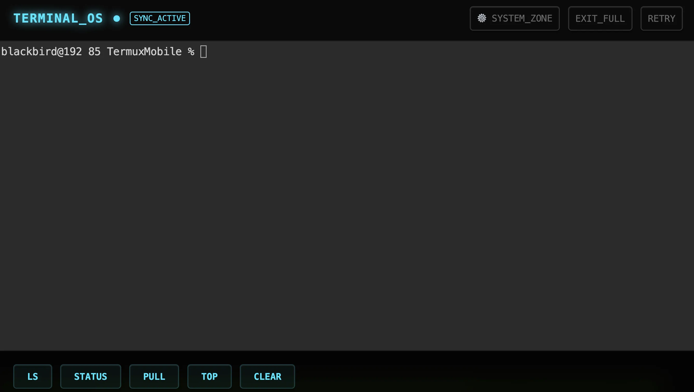

### Tab: Termux Mobile

- **Description**: A mobile-first terminal interface and remote execution engine designed to control local and remote Termux environments via WebSocket. It features WebSocket-based command injection, tmux session persistence, and a mobile-optimized quick-action toolbar for efficient DevOps on-the-go.

- **Does**:

    - **Remote Terminal Gateway**: High-fidelity WebSocket bridge for direct command injection into active TTY sessions.
    - **WebSocket Switchboard API**: Injects commands bypassing manual typing for rapid automation and task execution.
    - **Tmux Integration Layer**: Leverage session persistence with one-tap "Magic Buttons" for Git, LS, and Clear.
    - **Real-Time Connectivity HUD**: Continuous monitoring of terminal availability with intelligent local/remote failover.
    - **Intelligent Execution Queue**: Manages command sequences to prevent collisions with visual "Pending/Running" status tags.
    - **Mobile-Optimized Quick Bar**: Haptic-focused toolbar for high-frequency commands tailored for touchscreen precision.

- **Can’t**:

    - **Standalone Runtime Hosting**: Client-only gateway; requires a running backend (ttyd/tmux) on the target host.
    - **Native Binary File Syncing**: Optimized for text-based command execution; lacks direct drag-and-drop file transfers.
    - **Universal OS Command Mapping**: Quick-action buttons are strictly hardcoded for standard Unix-like shell environments.

------

### Components
###### [Termux Mobile Viewer](D.q.termuxmobile.viewer.md)
###### [Termux Mobile Components {index.jsx}](_RESOURCES/DATACORE/78%20TermuxMobile/src/index.jsx)

