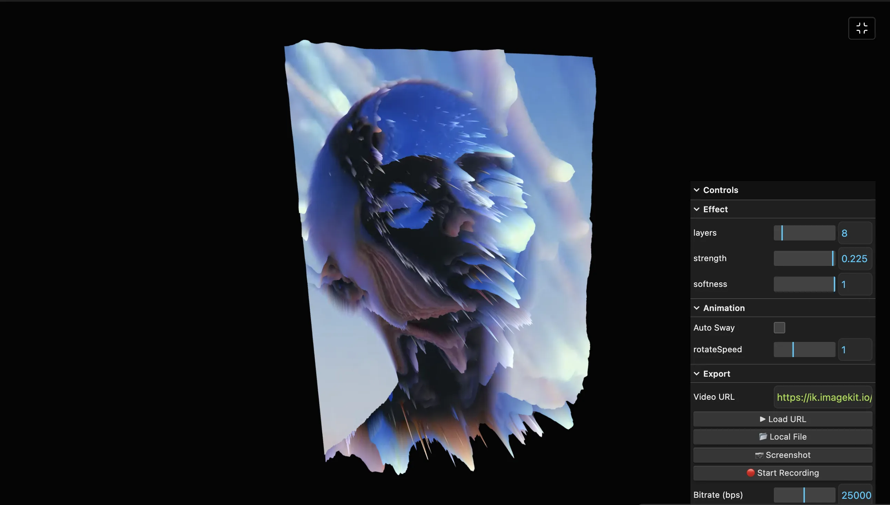

### Tab: Displacement View

- **Description**: A high-performance creative tool built with Three.js and custom GLSL vertex/fragment shaders. It allows users to map the luminance of any image or video source onto a 3D geometry, creating dynamic "topographical" elevations in real-time. The component features a robust export system supporting high-bitrate MediaRecorder captures, precise shader controls via a HUD interface, and seamless support for drag-and-drop media integration.

- **Does**:

    - **WebGL Displacement Engine**: Implements a high-precision vertex shader for real-time mesh topography based on luminance.
    - **Multi-Modal Source Support**: Seamlessly maps images, remote video URLs, and local file uploads to 3D geometry.
    - **Dynamic HUD Interface**: Tweakpane/Lil-gui integration for precise manipulation of elevation and surface softness.
    - **GPU Sway Animation**: Features an automated sway mode for organic-feeling procedural motion graphics.
    - **Production Export Pipeline**: Built-in high-bitrate video capture (up to 50Mbps) for professional grade output.
    - **GPU Acceleration**: Highly optimized vertex processing with intelligent resolution scaling for hardware efficiency.

- **Can’t**:

    - **Custom Mesh Ingestion**: Optimized for high-density primitive planes; does not support `.GLB` or `.OBJ` imports.
    - **Transparent Exports**: Video captures are opaque; does not preserve alpha channel transparency in rendered output.
    - **Audio Processing**: Logic is visual-only; source audio is excluded to prioritize GPU vertex bandwidth.

------

### Components
###### [Displacement View Viewer](D.q.displacementview.viewer.md)
###### [Displacement View Components {index.jsx}](_RESOURCES/DATACORE/79%20DisplacementView/src/index.jsx)
