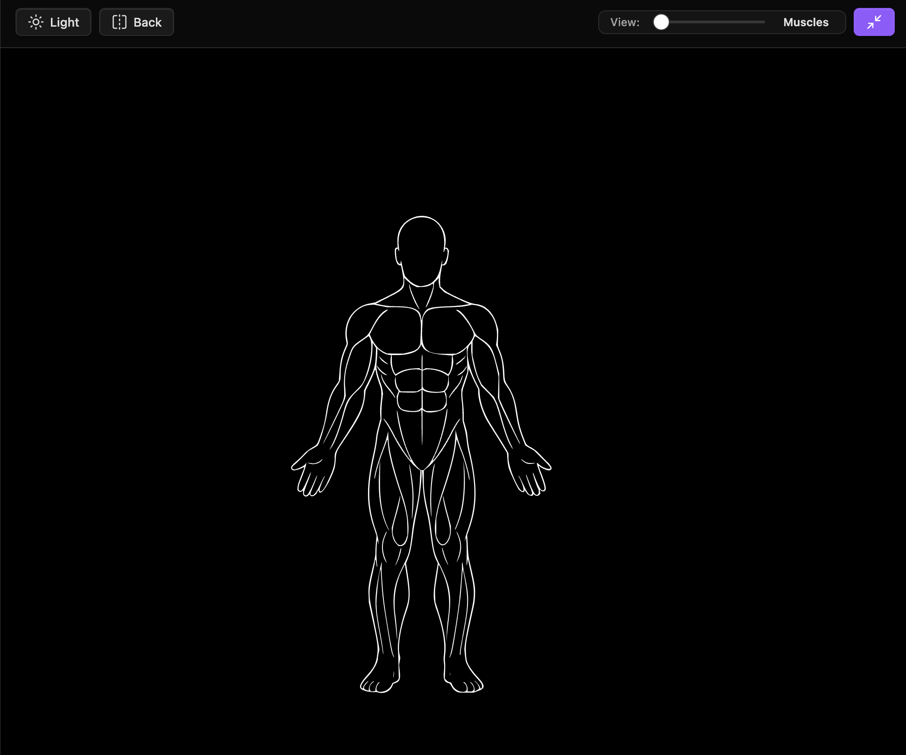
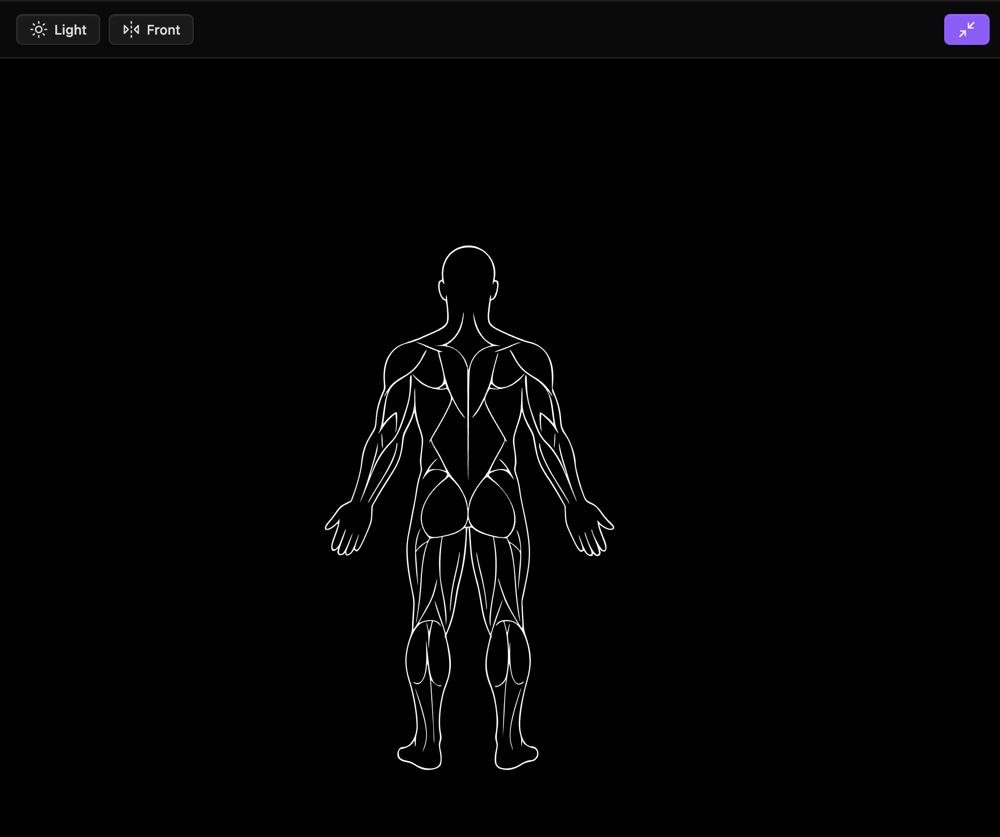
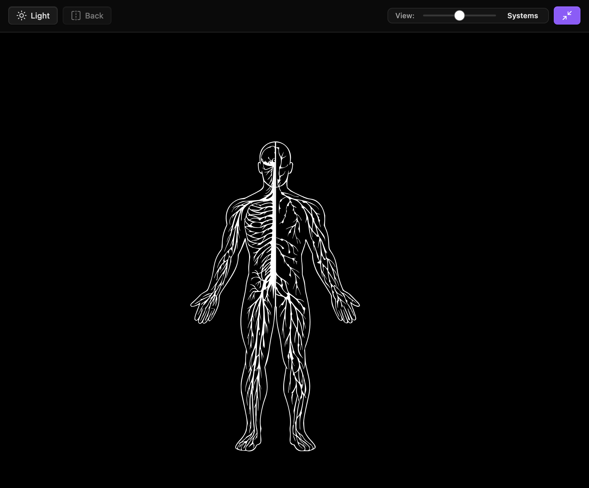
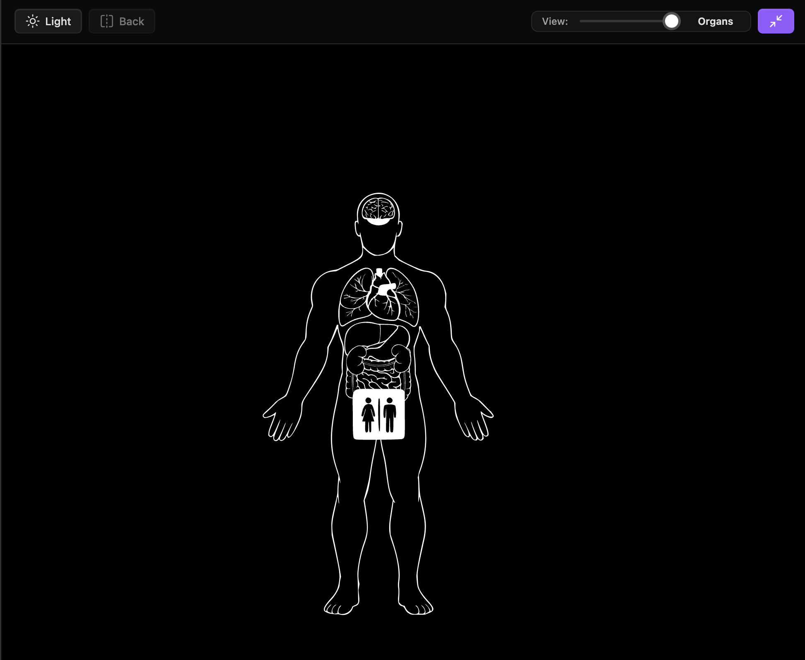

### Tab: Fitness Explorer

- **Description**: A multi-layered, interactive UI that serves as a visual hub for exploring categorized content. It uses detailed SVG diagrams of the human anatomy as a primary navigation interface. Clicking on a specific body part or system dynamically queries the vault for a corresponding content file and launches a dedicated CustomFeedViewer to display its contents, creating a seamless "explorer-to-viewer" experience.
    
- **Does**:
    
    - **Visual & Interactive Navigation**:
        - Renders a highly detailed, interactive SVG of the human body as its main interface.
        - Provides multiple anatomical views that can be toggled, including muscular, systemic, and organ layers.
        - Each distinct body part on the SVG is a clickable "hotspot."
    - **Dynamic Content Routing**:
        - When a user clicks a body part (e.g., "chest"), the component triggers a Dataview query to dynamically search the vault for a content file matching a specific naming convention (e.g., a file named CHEST.enigmas..md).
        - If a matching file is found, it automatically transitions from the anatomical view to the CustomFeedViewer, loading the discovered file as a browsable media feed.
    - **Hierarchical Navigation & State Management**:
        - Includes a "Back" button within the content feed that allows the user to seamlessly return to the main anatomical explorer.
        - Persists the user's last-viewed state (e.g., front/back view, muscle/organ layer, dark/light mode) in localStorage, so the explorer's settings are remembered across sessions.
        - Gracefully handles cases where no content file is found for a selected body part by displaying a user-friendly "Empty View."
    - **Immersive Full-Pane Experience**: Both the anatomical explorer and the subsequent content feed are designed to automatically expand and fill the entire Obsidian pane, creating an app-like environment.

- **Can’t**:
   
    - **Generate Content**: The component is a navigator and does not create the anatomical SVG diagrams or the content files it links to. The user is responsible for creating and correctly naming these files.    
    - **Function Without a Strict Naming Convention**: The dynamic routing is entirely dependent on files being named according to a specific pattern (e.g., GROUPNAME.enigmas..md). If files are named differently, the navigation will fail to find the content.
    - **Directly Edit the Anatomical Map**: The SVG is interactive for navigation but its structure and hotspots are hard-coded. Changes to the anatomical diagram require editing the component's source code.
    - **Provide Nested Navigation**: The navigation is two-layered (Explorer -> Feed -> Back to Explorer). It does not support drilling down into further sub-categories from within a content feed.

---

### Components

###### [Fitness Explorer Viewer](D.q.fitnessexplorer.viewer.md)

###### [Fitness Explorer Component](D.q.fitnessexplorer.component.md)

