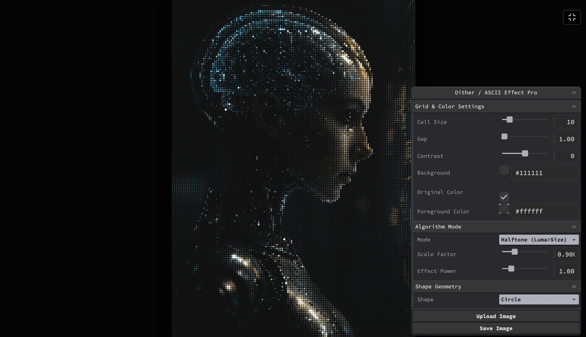

### Tab: Dither Pro

- **Description**: A professional-grade image dithering and geometric mapping engine featuring 23+ algorithms and custom SVG path support. It combines traditional dithering techniques with modern geometric mapping, allowing users to transform images into complex patterns of 25+ primitive shapes or custom-injected SVG paths. Powered by a high-performance Canvas 2D engine and Tweakpane HUD, it offers real-time control over contrast, cell density, and complex algorithms.

- **Does**:

    - **Advanced Dithering Engine**: Features 23+ procedural algorithms including Halftone, Flow Field, Edge Detection, CRT Scanline, and Bio-Organic cellular layouts.
    - **Luminance-to-Geometry Mapping**: Real-time conversion of pixel data to geometric scale, rotation, opacity, and displacement intensity.
    - **Library of 25+ Shape Primitives**: Includes an extensive library of shapes ranging from standard polygons to organic forms like leaves and flowers.
    - **Custom SVG Path Injection**: Supports drag-and-drop SVG functionality for custom vector-path dithering.
    - **Tweakpane HUD Integration**: Professional-grade panel for fine-tuning grid spacing, contrast, and algorithm-specific parameters.
    - **High-Resolution Raster Export**: Exports final processed canvas directly to PNG for external production pipelines.

- **Can’t**:

    - **Live Video Processing**: Optimized for high-resolution static imagery; does not support real-time video stream processing.
    - **Multi-Path SVG Support**: Limited to single SVG paths; complex multi-element SVGs must be flattened for injection.
    - **Vector PDF Export**: Final output is rendered to a raster canvas and can only be exported as a PNG image.

------

### Components
###### [Dither Pro Viewer](D.q.ditherpro.viewer.md)
###### [Dither Pro Components {index.jsx}](src/index.jsx)
