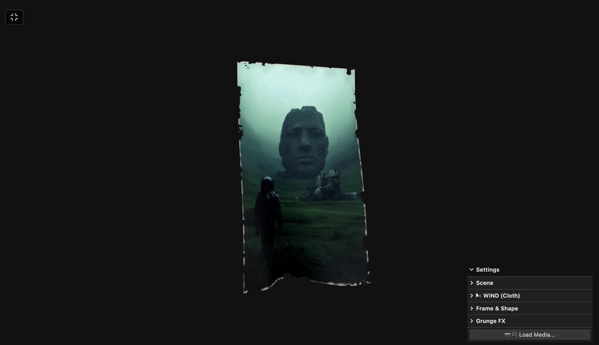

### Tab: Torn Cloth

- **Description**: An interactive WebGL physics simulation that combines real-time cloth dynamics with procedural torn-edge paper aesthetics. It merges GPU-accelerated cloth physics with procedural geometry, using custom GLSL shaders to simulate complex wind-driven ripples and Multi-Octave FBM noise to generate organic, ragged edges on images and video frames.

- **Does**:

    - **WebGL Physics & Dynamics**: Implements real-time wind-driven ripples and pin-point influence dynamics directly on the GPU for zero-latency motion.
    - **Procedural Torn Edges**: Utilizes Multi-Octave FBM noise to procedurally generate organic, ragged edges on images and video frames.
    - **High-Fidelity Rendering**: Features a multi-layer effects stack including grain synthesis, procedural scratches, and adjustable vignettes.
    - **GPU Material Controls**: Integrates lil-gui for real-time manipulation of wind force, fabric detail, edge amplitude, and shadow opacity.
    - **Dynamic Texture Mapping**: Supports high-resolution images and video streams with synchronized coordinate mapping and aspect ratio preservation.
    - **Haptic Shadow Interaction**: Renders dynamic depth-based shadows that respond to the cloth displacement, creating an immersive, tactile visual experience.

- **Can’t**:

    - **Complex Collisions**: Optimized for high-density plane simulations; does not support collisions with external 3D geometries.
    - **Material Variety**: Fine-tuned for paper and canvas-like materials; does not simulate specialized materials like silk or leather.
    - **Native Export**: Designed for real-time interactive viewing and does not include a native internal video encoding engine.

------

### Components
###### [Torn Cloth Viewer](D.q.torncloth.viewer.md)
###### [Torn Cloth Components {index.jsx}](_RESOURCES/DATACORE/81%20TornCloth/src/index.jsx)
