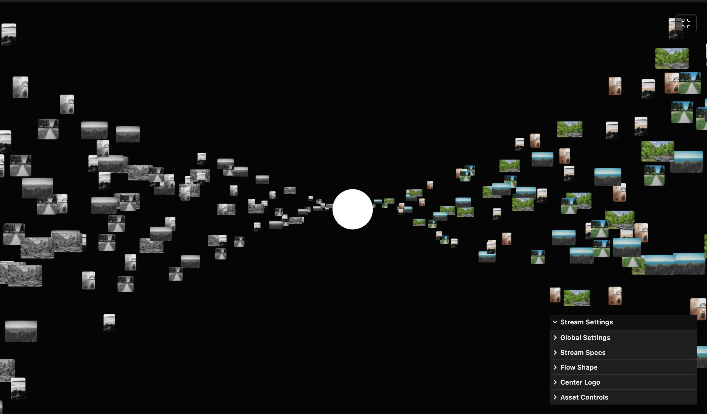

### Tab: Image Stream

- **Description**: A high-performance WebGL image flow engine designed to stream hundreds of visual assets through procedurally animated paths. Utilizing GPU-accelerated InstancedMesh rendering, it can simultaneously handle over 1,000 image assets across dual procedural streams. The engine maps assets to complex flow paths governed by speed, spread, and curve power variables.

- **Does**:

    - **Instanced WebGL Rendering**: Orchestrates over 1,000 image instances simultaneously using optimized GPU logic with zero performance degradation.
    - **Procedural Flow Physics**: Animates assets along complex spatial paths with real-time controls for speed, spread, and curve power.
    - **Dual-Stream Mapping**: Separates assets into independent Left and Right streams, each with adjustable grayscale mapping and spread factors.
    - **Real-Time Shader FX**: Features procedurally rounded corners, transparency mapping, and aspect ratio preservation per-instance.
    - **Center Branding Interface**: Dedicated UI layer for SVG logos or hero-focused branding within the flow.
    - **Bulk Media Ingestion**: Procedural loading pipeline for rapid mapping of massive image sets via drag-and-drop or batch selection.

- **Can’t**:

    - **Video Streaming**: Optimized for static assets; does not support real-time video textures for thousands of parallel instances.
    - **Physical Collisions**: Assets follow mathematical paths; the engine does not perform physical inter-mesh collision detection.
    - **Native Animation Export**: Focused on interactive real-time viewing; the component does not include an internal video encoding suite.

------

### Components
###### [Image Stream Viewer](D.q.imagestream.viewer.md)
###### [Image Stream Components {index.jsx}](_RESOURCES/DATACORE/82%20ImageStream/src/index.jsx)
