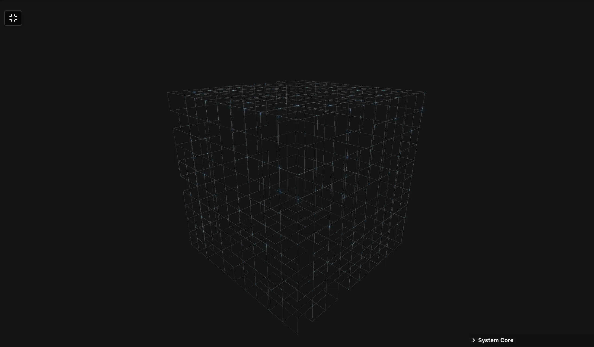

### Tab: Signal Mesh

- **Description**: Signal Mesh is a procedural 3D network visualization engine that transforms geometric volumes into animated, glowing signal flow meshes. It creates a high-tech "cyber-grid" effect ideal for infrastructure and connectivity motifs, utilizing Three.js and custom GLSL shaders for real-time volumetric rendering.

- **Does**:

    - **Procedural Network Engine**: Generates complex lattices within Cube, Sphere, Pyramid, Hexagon, and Torus volumes using random-walk logic.
    - **Dynamic Geometry Rebuilding**: Re-computives mesh topology in real-time based on form-factor changes or surface isolation toggles.
    - **GLSL Signal Flow Shaders**: Implements high-speed pulse animation with additive blending and glowing signal tails.
    - **Post-Processing Stack**: Features integrated Unreal Bloom for volumetric glow and Exponential Fog for spatial depth.
    - **Comprehensive HUD Controls**: Tweakpane integration for real-time control over bloom, density, color, and fog.
    - **Orbit & Focus Logic**: Includes smooth `OrbitControls` for 360-degree spatial inspection.

- **Can't**:

    - **External Model Imports**: Generates geometry procedurally; does not support importing `.GLB` or `.OBJ` models.
    - **Data-Driven Topology**: Paths are procedurally generated; does not support manual JSON-based graph theory mapping.
    - **Multi-Pulse Color Sequencing**: Current shader model uses a unified signal color; does not support per-pulse independent mapping.
    

------

### Components
###### [Signal Mesh Viewer](D.q.signalmesh.viewer.md)
###### [Signal Mesh Components {index.jsx}](src/index.jsx)
