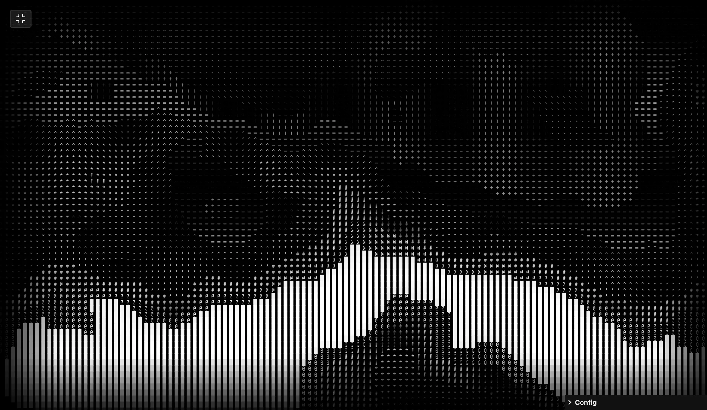
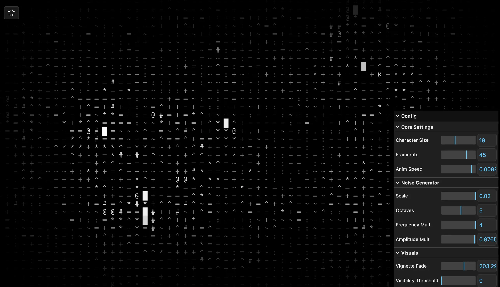

### Tab: Perlin Mountains

- **Description**: Perlin Mountains is an algorithmic ridged-noise terrain visualization engine that renders generative landscapes using a high-density ASCII character mapping. Built on p5.js, it implements a sophisticated multi-octave ridged multifractal noise algorithm, discretized into a grid of 12-level density-mapped ASCII characters.

- **Does**:

    - **Generative Noise Engine**: Multi-octave ridged noise for sharp terrain-like ridges and internal valleys.
    - **Real-Time Freq/Amp HUB**: Precision tweaking of noise frequency and amplitude for shifting landscapes.
    - **12-Level ASCII Synthesis**: Translates continuous noise values into density-mapped alphanumeric characters.
    - **Dynamic Character Gridding**: Real-time recalculation of grid density and character sizing for adaptive layouts.
    - **Procedural Vignette Fading**: Smoothly fades generative art at the edges for seamless dashboard integration.
    - **Grid-Based Caching**: Optimized CPU performance through flattened noise/fade buffers for framerate-aware animation.

- **Can't**:

    - **3D Polygonal Geometry**: Strictly 2D and grid-based; does not support rendering or importing `.GLB` models.
    - **Multi-Channel Coloration**: Focused on monochromatic high-contrast ASCII; no support for user-defined colors.
    - **Hardware GPU Shading**: Rendering is CPU-bound via p5.js; does not utilize WebGL or fragment shaders.

------

### Components
###### [Perlin Mountains Viewer](D.q.perlinmountains.viewer.md)
###### [Perlin Mountains Components {index.jsx}](_RESOURCES/DATACORE/85%20PerlinMountains/src/index.jsx)
