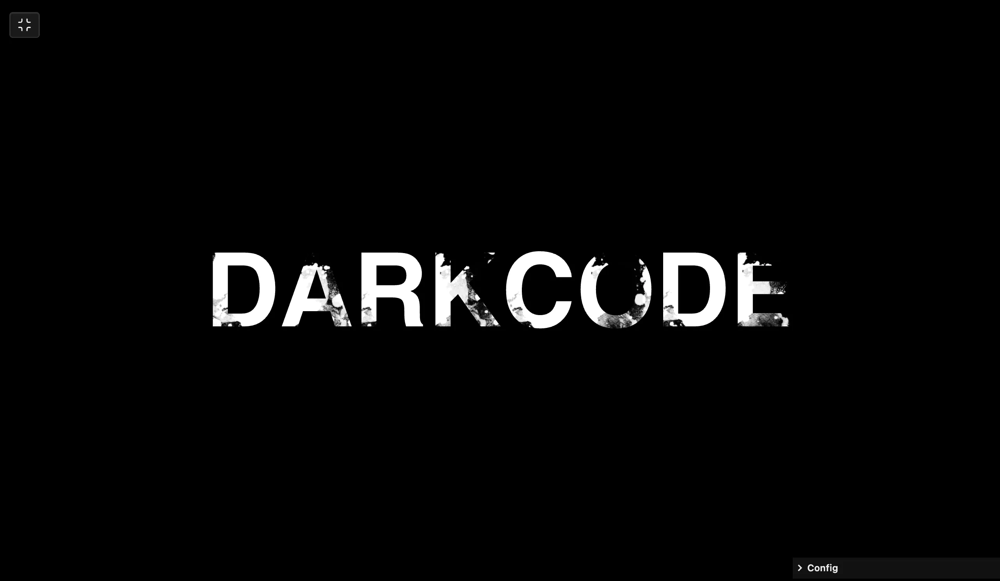

### Tab: Masked Text

- **Description**: A performance-optimized typography component designed for high-impact visual headers. It utilizes CSS masking techniques (Webkit-mask-image) to overlay a complex, high-contrast grunge bitmap onto live, editable text. The component is powered by a real-time React styling engine that syncs with a dedicated GUI for immediate control over font weight, scale, transform, and color mapping.

- **Does**:

    - **Typography Masking Engine**: Applies high-fidelity weathered grunge masks to live, editable text.
    - **Real-Time Style Synchronization**: Maps React state directly to typography attributes for instantaneous feedback.
    - **Dynamic Layout Logic**: Precision control over font weight (100-900), scale, and temporal text transforms.
    - **Unified Color Mapping**: Synchronizes foreground and background layers for optimal contrast and integration.
    - **Full-Tab Lifecycle Staging**: Integrates with Datacore's immersion protocols for cinematic title presentations.
    - **Integrated System HUD**: Dedicated configuration panel for rapid prototyping of typographic design systems.

- **Can’t**:

    - **Custom Mask Uploads**: Currently limited to a curated internal grunge library; no UI-based texture ingestion.
    - **Multi-Layer Masking**: Supports a single primary mask layer; does not allow for complex composite masking.
    - **SVG Path Clipping**: Optimized for bitmap-based texture masking; does not support vector-path clipping logic.
    - **Independent Font Injection**: Relies on host-level typeface availability; does not bundle heavy external font files.

------

### Components
###### [Masked Text Viewer](D.q.maskedtext.viewer.md)
###### [Masked Text Components {index.jsx}](_RESOURCES/DATACORE/86%20MaskedText/src/index.jsx)
