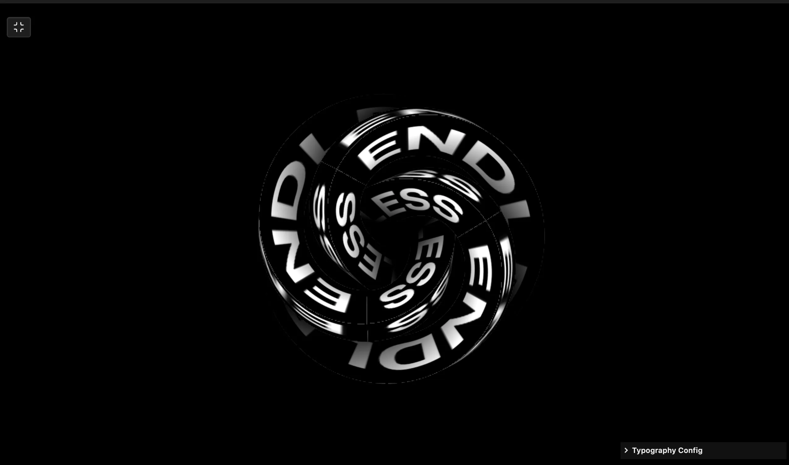

### Tab: Kinetic Type

- **Description**: Kinetic Type is a sophisticated 3D typography engine that bridges 2D graphic design and 3D generative art. Utilizing a real-time "Canvas-to-Texture" pipeline, it maps dynamic typographic patterns onto complex Torus Knot geometry with synchronized GLSL scroll shaders for infinite motion.

- **Does**:

    - **Dynamic Type Synthesis**: Real-time texture generation from live text inputs with font-property synchronization.
    - **Torus Knot Shader Mapping**: Maps typographic textures onto complex geometric sculptures using high-fidelity UV shaders.
    - **Kinetic Scroll Engine**: Implements custom GLSL UV shaders for high-speed synchronized X/Y scrolling.
    - **Programmable Texture Repetition**: Granular control over texture tiling factors for dense typographic landscapes.
    - **Live Typography HUD**: Tweakpane integration for instantaneous control over font weight, scale, and motion speed.
    - **Orbit Inspection System**: Smooth coordinate-tracked OrbitControls for 360-degree spatial viewing.

- **Can't**:

    - **Multi-Layer Type Composition**: Applies a unified texture mapping; does not support independent multi-layer splitting.
    - **Custom Model Ingestion**: Mapping is optimized for internal geometries; does not support external `.GLB` or `.OBJ` meshes.
    - **Heterogeneous Font Mapping**: Uses a single font-family context; mixing different font families on a single mesh is not possible.

------

### Components
###### [Kinetic Type Viewer](D.q.kinetictype.viewer.md)
###### [Kinetic Type Components {index.jsx}](_RESOURCES/DATACORE/88%20KineticType/src/index.jsx)
