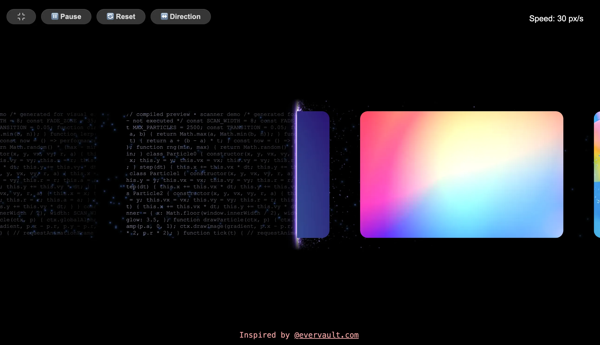

### Tab: Card Scanner

- **Description**: A dual-view kinetic card stream that utilizes real-time UV clipping and hybrid particle scanning for an X-ray data projection effect. It creates a high-tech, investigative aesthetic suitable for technical data browsing or security-themed UI modules, transitioning between standard imagery and generative ASCII code views.

- **Does**:

    - **Kinetic Card Stream**: Implements a high-inertia dragging system with velocity-based friction and infinite coordinates.
    - **Dual-Surface X-Ray Projection**: Utilizes UV clipping masks to transition cards between image and ASCII code views.
    - **High-Intensity Scanner Glow**: Features a multi-layered 2D Canvas light bar with dynamic intensity pulsing.
    - **3D Spatial Particles**: Integrates a Three.js background system for volumetric depth and atmospheric drift.
    - **Live ASCII Injection**: Procedurally generates technical code snippets to populate card surfaces dynamically.
    - **Intersection Event Logic**: Triggers scan-ping effects and particle bursts when cards intersect the central beam.

- **Can’t**:

    - **Multi-Beam Configurations**: Intersection logic is optimized for a single central vertical scanning beam.
    - **OCR Data Extraction**: The scanning effect is purely visual; does not perform real character recognition.
    - **Dynamic Card Resizing**: Card dimensions are hardcoded for optimal ASCII grid mapping and stream spacing.

------

### Components
###### [Card Scanner Viewer](D.q.cardscanner.viewer.md)
###### [Card Scanner Components {index.jsx}](src/index.jsx)

