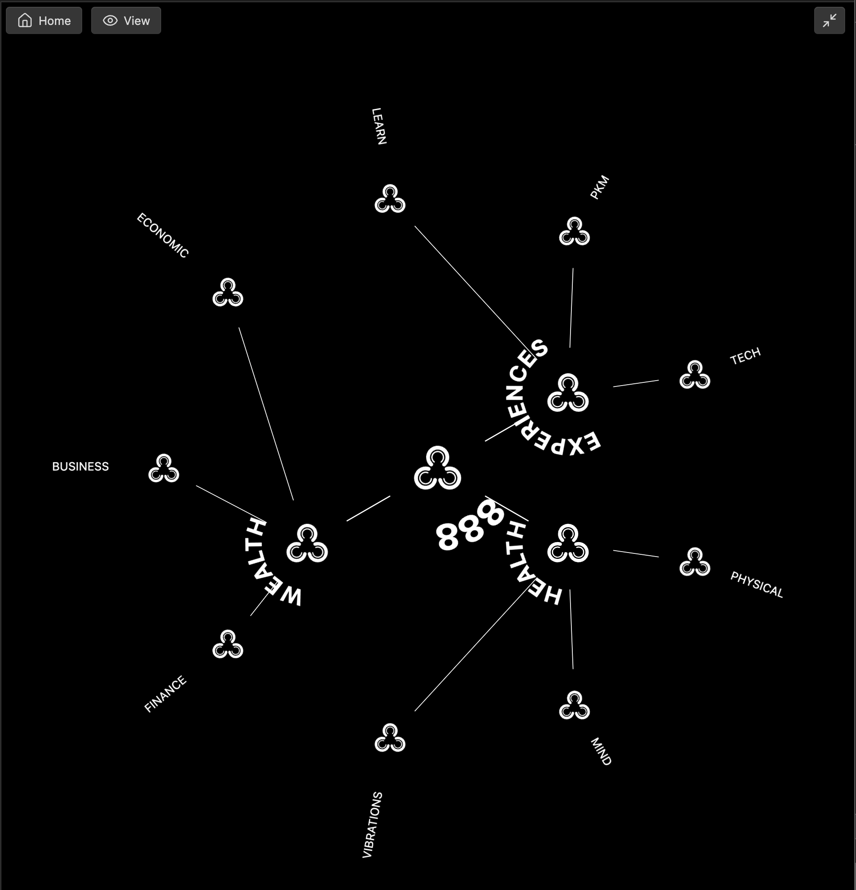
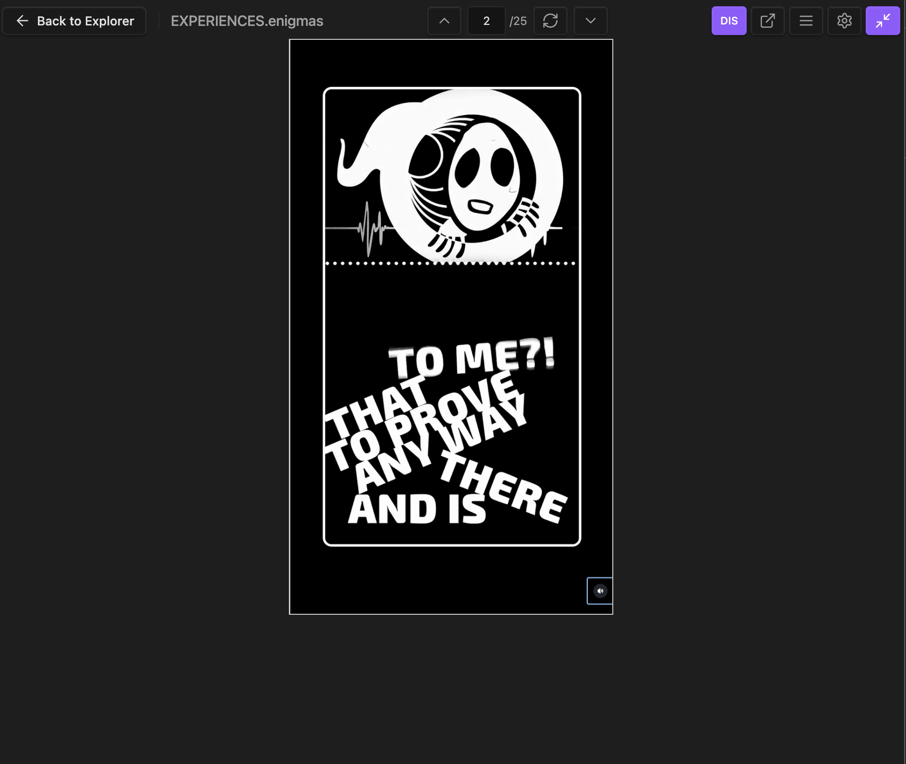

### Tab: Content Explorer 888

- **Description**: A two-stage interactive content navigation system. It begins with a dynamic, multi-ring radial menu that serves as a visual map for exploring hierarchical topics. Clicking a final node in this explorer then seamlessly transitions the user to a dedicated CustomFeedViewer to display the associated content, creating an integrated "explorer-to-viewer" workflow.
    
- **Does**:
    
    - **Hierarchical Radial Navigation**:
        - Renders an interactive radial (circular) menu with a central node and concentric rings of sub-topics.
        - The structure of the radial map is dynamically generated by parsing headers from a set of designated .namzu.md files. Clicking a node in an outer ring makes it the new center, allowing users to drill down through nested categories.
        - Supports navigating back up the hierarchy by clicking the center node or a dedicated "Home" button.
    - **Dynamic Content Routing**:
        - When a user clicks the "View" button from the radial explorer, the component dynamically searches the vault for a content file.
        - This routing is based on a strict naming convention, automatically converting the selected topic's .namzu name to a corresponding .enigmas file name to find the content feed.
    - **Integrated Content Viewing**:
        - Upon finding a matching file, it launches the CustomFeedViewer component, which displays the file's contents as a browsable, vertical feed of embedded media.
        - The feed viewer includes its own full set of features, such as platform-specific iframe styling, keyboard/swipe navigation, and an inline editor.
    - **Seamless Navigation Flow**:        
        - The content viewer includes an integrated "Back" button that returns the user to the radial explorer, preserving their navigation context.
        - The entire experience is designed to run in an immersive, full-pane mode, with options to lock or disable this functionality via the spawnType prop.

- **Can’t**:    

    - **Create or Modify the Navigation Map via UI**: The structure of the radial explorer is defined by the ###### headers within the .namzu.md files. It is not possible to add, remove, or reorder nodes directly from the visual interface.
    - **Persist Navigation State**: The radial explorer will always reset to its initial centerHeader when the note is reloaded. It does not remember the user's position within the hierarchy across sessions.
   

----

### Components

###### [Content Explorer 888 Viewer ](D.q.contentexplorer888.viewer.md)

###### [Content Explorer 888 Component](D.q.contentexplorer888.component.md)