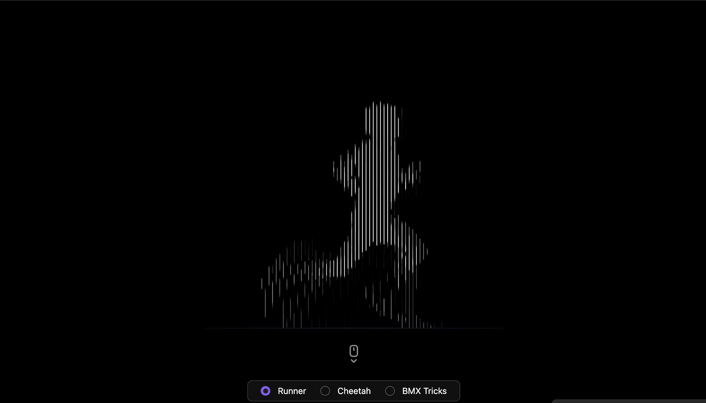

### Tab: Optical Illusion

- **Description**: Optical Illusion is a scroll-driven moiré mapping engine that creates high-fidelity visual illusions using CSS scroll-timelines and dynamic stripe synchronization. It leverages the Moiré effect—visual interference created by grid overlays—to simulate complex motion from static assets purely through interaction.

- **Does**:

    - **Moiré Animation Engine**: Synchronizes stripe-grid offsets with native CSS scroll-timelines for user-driven motion.
    - **Dynamic Stripe Synthesis**: Generates interference patterns via programmable gradients and `@property` interpolation.
    - **Infinite Vertical Scroll**: Implements a seamless scroll-jump system for uninterrupted kinetic movement.
    - **Sticky Visual Staging**: Positions focal points through sticky centering while external scroll-depth drives the effect.
    - **Interactive Preset Library**: Includes pre-configured mappings for Human Runner, Running Cheetah, and BMX visuals.
    - **Tactical Mode Switching**: Integrated UI HUD for real-time switching between different visual algorithms.

- **Can't**:

    - **Legacy Browser Rendering**: Relying on modern scroll-driven animation; lacks support on non-compliant browsers.
    - **Automated Asset Ingestion**: Moiré alignment requires precise stripe-pixel ratios; not suitable for arbitrary uploads.
    - **Horizontal Scroll Trigger**: Current logic is strictly Y-axis mapped; does not support horizontal scroll input.

------

### Components
###### [Optical Illusion Viewer](D.q.opticalillusion.viewer.md)
###### [Optical Illusion Components {index.jsx}](_RESOURCES/DATACORE/90%20OpticalIllusion/src/index.jsx)
