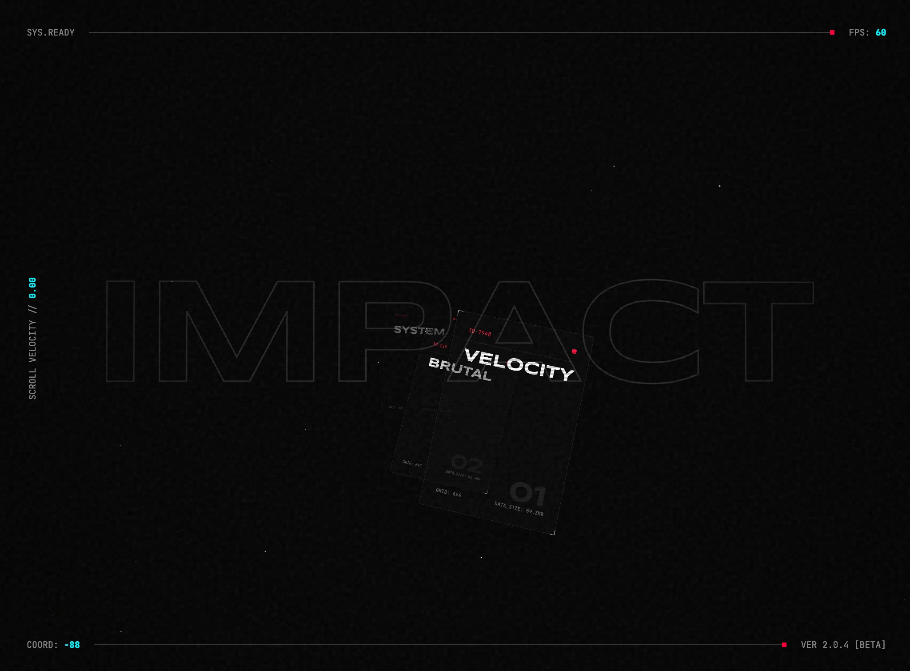

### Tab: Hyper Scroll

- **Description**: Hyper Scroll is a high-velocity 3D virtual scroll engine featuring brutalist HUD overlays, custom momentum physics, and dynamic perspective warping. It transforms standard content into an immersive, cinematic flight through space and data, utilizing hardware-accelerated CSS 3D transforms for extreme performance.

- **Does**:

    - **Virtual Physics Engine**: Implements a custom physics model with programmable momentum, friction, and spring-velocity.
    - **Z-Axis Infinite Looping**: Utilizes coordinate wrapping for an infinite traversal experience through 3D spatial content.
    - **Perspective Warp**: Dynamically scales the camera FOV based on scroll velocity for a "tunnel-vision" warp effect.
    - **Velocity-Stretched Particles**: Procedural starfield with 3D transform stretching that responds to acceleration peaks.
    - **Brutalist HUD Staging**: Integrates scanlines, noise textures, and vignettes for a high-contrast technical aesthetic.
    - **Chromatic Aberration Logic**: Simulates RGB-split aberration on typography that scales with movement speed.

- **Can't**:

    - **Native Scroll Integration**: Custom virtual model; does not support native browser scrollbars or legacy container scrolling.
    - **Mobile GPU Overhead**: Performance may be impacted on older mobile GPUs due to multiple CSS blur filters.
    - **Automatic Asset Scaling**: Expects pre-optimized assets; no automatic image resizing or compression pipelines.

------

### Components
###### [Hyper Scroll Viewer](D.q.hyperscroll.viewer.md)
###### [Hyper Scroll Components {index.jsx}](src/index.jsx)
