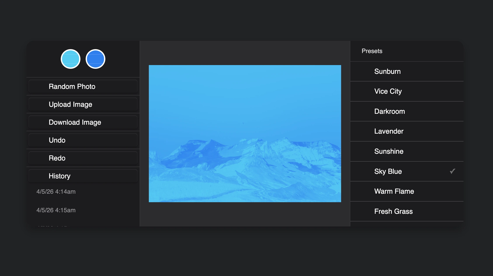

### Tab: Duotone Editor

- **Description**: Duotone Editor is a professional-grade image processing utility that utilizes Canvas API pixel mapping to create high-fidelity duotone transformations with full history support. It combines deep technical logic with a tactical preset library for creative visual design, ensuring high-fidelity color interpolation through direct pixel-data manipulation.

- **Does**:

    - **Canvas Pixel Mapping**: Directly processes raw pixel data arrays for high-fidelity color synthesis.
    - **Dual-Color Interpolation**: Real-time RGB calculation between user-defined hex codes based on luminance.
    - **Professional History Engine**: Implements a session-based history stack for infinite undo/redo navigation.
    - **Timestamped State Logging**: Maintains a tactical panel with snapshot history for precise session recovery.
    - **Hybrid Asset Ingestion**: Supports local file uploads and procedural randomizer injection via external APIs.
    - **Multi-Format Export Pipeline**: Downloads processed results in high-quality PNG, JPEG, and WebP formats.

- **Can't**:

    - **Persistent Session Storage**: History stack is session-based; does not survive browser or workspace reloads.
    - **Vector-Based Scaling**: Operates purely on raster data; lacks SVG export or vector-path upscaling.
    - **Multi-Layer Composition**: Optimized for single-layer transformations; does not support complex masking.

------

### Components
###### [Duotone Editor Viewer](D.q.duotoneeditor.viewer.md)
###### [Duotone Editor Components {index.jsx}](src/index.jsx)
