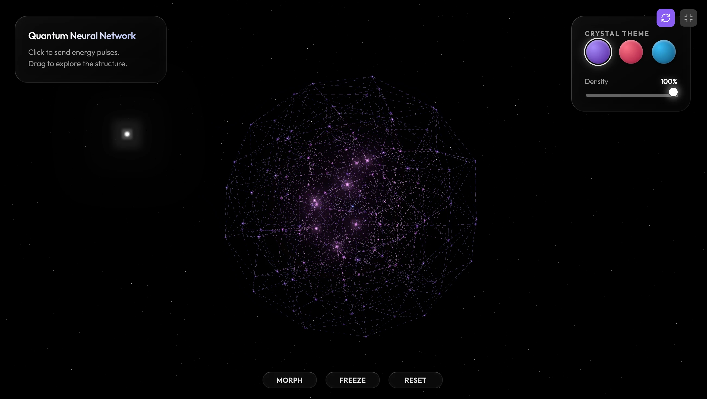

### Tab: NeuralNetwork

- **Description**: An interactive quantum neural topology engine that utilizes procedural generation and raycasted energy propagation for immersive spatial visualization. It combines high-performance Three.js logic with advanced shader dynamics for a deeply atmospheric technical experience.

- **Does**:
   
    - **Procedural Topology Generation**:    
        - **Formation Morphing**: Utilizes Fibonacci sphere, helix helical, and fractal branching algorithms to generate diverse 3D structural formations.
        - **Dynamic Density Scaling**: Implements real-time structural pruning and connection synthesis to adjust network complexity without performance drops.
    - **Interactive Energy Physics**:
        - **Raycasted Pulse Propagation**: Features a multi-slot energy buffer system that translates mouse/touch intersections into volumetric light pulses.
        - **Pulse-Vector Dynamics**: Propagates energy through the network nodes using custom distance-based shader logic and HSL-offset color shifting.
    - **Advanced Shader Engine**:
        - **Simplex-Driven Node Motion**: Utilizes 3D Simplex noise within vertex shaders to create organic breathing and turbulence effects for outer nodes.
        - **Volumetric Post-Processing**: Integrates UnrealBloom passes, exponential fog, and additive blending pass-layers for a high-contrast quantum aesthetic.

- **Can’t**:
   
    - **True Neural Training**: The component is a visual simulation engine; it does not support real backpropagation, weight training, or machine learning data ingestion.    
    - **Structural JSON Overrides**: Network architecture is strictly procedural; manual overrides of specific node coordinates via external JSON files are not supported.
    - **Low-End Graphics Mode**: The visual fidelity relies heavily on multi-pass blooming and complex shaders; performance may be degraded on systems without dedicated GPUs.

----

### Components

###### [NeuralNetwork Viewer](D.q.neuralnetwork.viewer.md)
