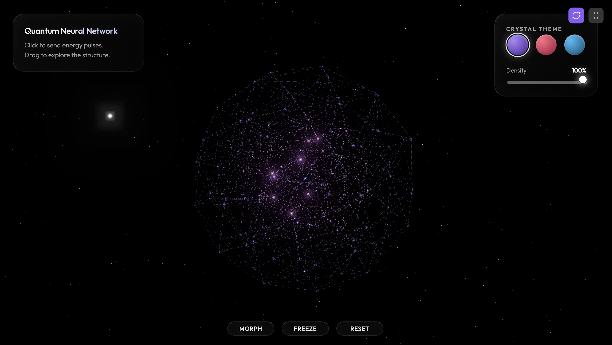

### Tab: Neural Network

- **Description**: Neural Network is a high-fidelity spatial visualization engine that simulates complex data topologies through procedural generation and interactive energy dynamics. Features multiple algorithmic formations including Crystalline Sphere and Fractal Web, driven by custom GLSL shaders for immersive quantum-aesthetic visualization.

- **Does**:

    - **Procedural Topology Generation**: Morphing between Fibonacci sphere, helix lattice, and fractal branching.
    - **Dynamic Density Scaling**: Real-time structural pruning and connection synthesis without performance loss.
    - **Raycasted Pulse Propagation**: Interactive energy buffer system that translates mouse/touch to volumetric light pulses.
    - **Quantum Vector Dynamics**: Distance-based shader logic for propagating energy through network nodes.
    - **3D Simplex Pathing**: Vertex shaders utilize node turbulence for organic architectural "breathing" effects.
    - **Volumetric Post-Processing**: Integrated UnrealBloom and exponential fog for deep atmospheric rendering.

- **Can't**:

    - **Real Backpropagation Training**: Strictly a visual simulation; does not support real machine learning ingestion.
    - **Structural Manual Overrides**: Architecture is purely procedural; lacks support for custom node JSON positioning.
    - **Legacy Graphics Buffering**: High-fidelity bloom and shading requires dedicated GPU acceleration for stability.

------

### Components
###### [Neural Network Viewer](D.q.neuralnetwork.viewer.md)
###### [Neural Network Components {index.jsx}](src/index.jsx)
