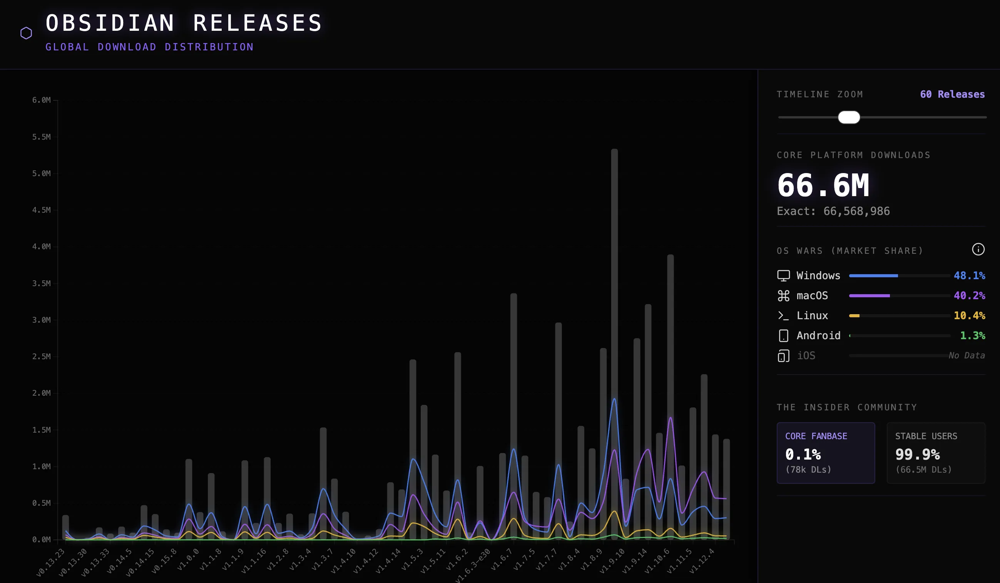

### Tab: Obsidian Download Stats

- **Description**: A high-fidelity telemetry engine that visualizes global Obsidian release distribution and market share analytics via real-time D3.js topology. It provides a tactical intelligence HUD for monitoring ecosystem growth across all major platforms, processing raw GitHub asset counts into chronological version snapshots.

- **Does**:

    - **Multi-Vector Telemetry Ingestion**: Implements asynchronous fetch cycles for multi-page historical GitHub release data.
    - **Real-Time Data Synthesis**: Processes raw asset counts into chronologically segregated version snapshots.
    - **Quantum Market Segmentation**: Precise platform market share calculation based on binary extensions (.dmg, .exe, .deb).
    - **Insider Divergence Analysis**: Monitors adoption gaps between stable and early-access versions to gauge community engagement.
    - **Interactive D3.js Topology**: SVG-based bar charts with smooth transition pipelines and monochrome styling.
    - **Dynamic Timeline Zooming**: Real-time slider controls to adjust release window visibility for deep-history audits.

- **Can’t**:

    - **Absolute Mobile Telemetry**: GitHub API cannot provide App Store or Play Store metrics for iOS/Android distribution.
    - **API Rate Limitation Bypass**: Data ingestion is subject to GitHub's rate limits; high-frequency reloads may trigger outages.
    - **Persistent Local Caching**: Telemetry is fetched live; each session initiates a fresh sync from the external source.

------

### Components
###### [Obsidian Download Stats Viewer](D.q.obsidiandownloadstats.viewer.md)
###### [Obsidian Download Stats Components {index.jsx}](src/index.jsx)
